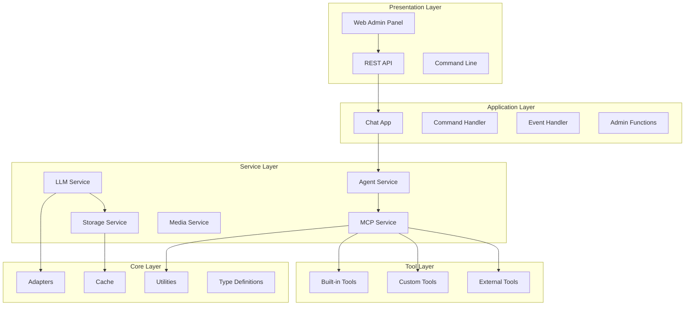
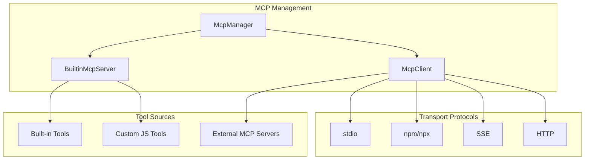
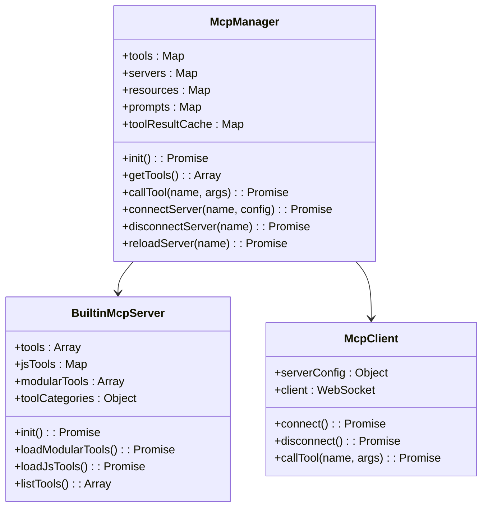
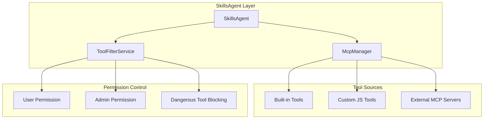
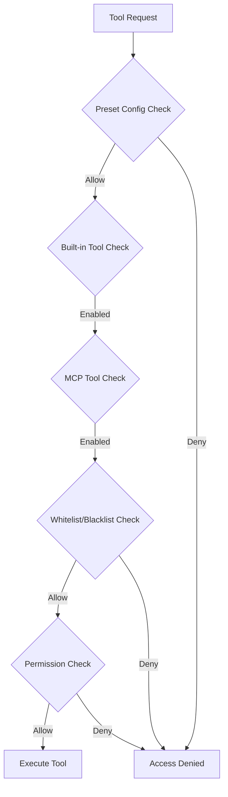
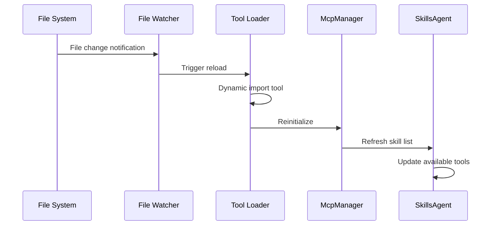

# Developer Guide <Badge type="tip" text="Advanced" />

A comprehensive guide for developers covering architecture, core components, and development best practices.

## Project Architecture {#architecture}

The project adopts a layered architecture design for clear separation of concerns.



### Directory Structure {#directory}

| Directory | Description |
|:----------|:------------|
| `apps/` | Application modules handling business logic |
| `src/core/` | Core modules providing base utilities and adapters |
| `src/mcp/` | MCP protocol handling for tool calls |
| `src/services/` | Service layer for various business services |
| `config/` | Configuration management |
| `data/` | Runtime data storage |
| `frontend/` | Next.js frontend admin panel |
| `docs/` | Project documentation |

## MCP System Architecture {#mcp-architecture}

MCP (Model Context Protocol) provides powerful tool calling capabilities.



### McpManager Core Functions {#mcp-manager}



## Skills Agent Layer {#skills-agent}

SkillsAgent provides a unified skill proxy interface.



### Tool Filter Mechanism {#tool-filter}



## Tool Development Guide {#tool-development}

### Best Practices {#best-practices}

#### 1. Clear Tool Descriptions

```javascript
// ✅ Good - clearly explains function and use case
description: 'Query real-time weather info for a city, including temperature, humidity, wind'

// ❌ Bad - vague and unclear
description: 'Get weather'
```

#### 2. Parameter Validation and Error Handling

```javascript
async run(args, context) {
    const { city } = args
    
    // Validate required parameters
    if (!city || typeof city !== 'string') {
        return { error: 'Please provide a valid city name' }
    }
    
    // Validate parameter range
    if (city.length > 50) {
        return { error: 'City name too long' }
    }
    
    // Process business logic
    try {
        const response = await fetch(apiUrl)
        if (!response.ok) {
            return { error: `API request failed: HTTP ${response.status}` }
        }
        
        const data = await response.json()
        return { success: true, data }
    } catch (error) {
        logger.error('[WeatherTool] Execution failed:', error)
        return { error: `Operation failed: ${error.message}` }
    }
}
```

#### 3. Timeout Control

```javascript
async run(args, context) {
    try {
        const controller = new AbortController()
        const timeout = setTimeout(() => controller.abort(), 10000)
        
        const response = await fetch(url, {
            signal: controller.signal
        })
        
        clearTimeout(timeout)
        return { success: true, data: await response.json() }
        
    } catch (error) {
        if (error.name === 'AbortError') {
            return { error: 'Request timeout' }
        }
        return { error: error.message }
    }
}
```

### Basic Tool Template {#tool-template}

```javascript
// data/tools/weather.js
export default {
    name: 'get_weather',
    
    function: {
        name: 'get_weather',
        description: 'Query weather info for a city',
        parameters: {
            type: 'object',
            properties: {
                city: {
                    type: 'string',
                    description: 'City name'
                }
            },
            required: ['city']
        }
    },

    async run(args, context) {
        const { city } = args
        
        try {
            const url = `https://wttr.in/${encodeURIComponent(city)}?format=j1`
            const response = await fetch(url)
            const data = await response.json()
            
            const current = data.current_condition[0]
            
            return {
                success: true,
                city,
                temperature: `${current.temp_C}°C`,
                weather: current.weatherDesc[0].value,
                humidity: `${current.humidity}%`
            }
        } catch (error) {
            return { error: `Failed to get weather: ${error.message}` }
        }
    }
}
```

### Hot Reload Mechanism {#hot-reload}



## Development Environment {#dev-environment}

### Requirements {#requirements}

| Dependency | Version | Purpose |
|:-----------|:--------|:--------|
| Node.js | >= 18 | Runtime environment |
| pnpm | >= 8.0 | Package manager |
| Redis | Optional | Caching and session storage |
| Build tools | Optional | Native module compilation |

### Local Development {#local-dev}

```bash
# Clone repository
git clone https://github.com/XxxXTeam/chatai-plugin.git
cd chatai-plugin

# Install dependencies
pnpm install

# Build native modules
pnpm rebuild better-sqlite3

# Start frontend development
cd frontend && pnpm dev
```

### VSCode Debug Configuration {#vscode-debug}

Add to `.vscode/launch.json`:

```json
{
    "version": "0.2.0",
    "configurations": [
        {
            "type": "node",
            "request": "attach",
            "name": "Attach to Yunzai",
            "port": 9229,
            "restart": true
        }
    ]
}
```

Start Yunzai with debugging:

```bash
node --inspect app
```

## Code Style {#code-style}

### Naming Conventions {#naming}

| Type | Convention | Example |
|:-----|:-----------|:--------|
| Files | camelCase or PascalCase | `ChatService.js`, `helpers.js` |
| Classes | PascalCase | `ChatService`, `ContextManager` |
| Functions | camelCase | `getUserInfo`, `parseMessage` |
| Constants | UPPER_SNAKE_CASE | `MAX_TOKENS`, `DEFAULT_MODEL` |
| Variables | camelCase | `userId`, `groupId` |

### Error Handling {#error-handling}

```javascript
// ✅ Unified error handling
async function processRequest() {
    try {
        const result = await doSomething()
        return { success: true, data: result }
    } catch (error) {
        logger.error('[Module] Processing failed:', error)
        return { success: false, error: error.message }
    }
}
```

### Commit Conventions {#commit}

Following [Conventional Commits](https://www.conventionalcommits.org/):

```bash
# New feature
git commit -m "feat(mcp): add weather query tool"

# Bug fix
git commit -m "fix(adapter): fix streaming response interruption"

# Documentation
git commit -m "docs: update developer guide"

# Refactor
git commit -m "refactor(core): restructure message processing"
```

## Performance Optimization {#performance}

### Caching Strategy {#caching}

| Cache Type | Purpose |
|:-----------|:--------|
| **Redis Cache** | Session state, config data |
| **Memory Cache** | Frequently accessed tool definitions |
| **Database Cache** | SQLite local cache |
| **Tool Result Cache** | Tool execution results |

### Concurrency {#concurrency}

- **Parallel Promise Execution**: Components initialize in parallel
- **Streaming Response**: LLM streaming for better UX
- **Parallel Tool Execution**: Multiple tools execute concurrently

## Next Steps {#next}

- [Tool Development](/en/tools/) - Tool system details
- [Architecture Overview](/en/architecture/) - Deep dive into system architecture
- [MCP Configuration](/en/config/mcp) - MCP server configuration
