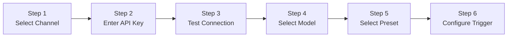

# Quick Start <Badge type="tip" text="5 min" />

This guide helps you complete ChatAI Plugin installation and basic configuration in **5 minutes**.

## Requirements {#requirements}

::: info Prerequisites
Make sure your environment meets the following requirements, otherwise installation may fail.
:::

| Dependency | Version | Description | Check Command |
|:-----------|:--------|:------------|:--------------|
| **Node.js** | `≥ 18.0` | LTS version recommended | `node -v` |
| **pnpm** | `≥ 8.0` | Package manager | `pnpm -v` |
| **Yunzai-Bot** | V3 | Miao-Yunzai or TRSS-Yunzai | - |

## Installation Steps {#installation}

### Step 1: Clone Plugin {#step-1}

Run in **Yunzai-Bot root directory**:

```bash
git clone https://github.com/XxxXTeam/chatai-plugin.git ./plugins/chatai-plugin
```

::: details Clone via SSH (optional)
```bash
git clone git@github.com:XxxXTeam/chatai-plugin.git ./plugins/chatai-plugin
```
:::

### Step 2: Install Dependencies {#step-2}

```bash
pnpm install
```

::: warning Note
Must be run in **Yunzai root directory**, not the plugin directory!
:::

### Step 3: Build Native Module {#step-3}

The plugin uses `better-sqlite3` as local database, which requires building native module:

```bash
pnpm rebuild better-sqlite3
```

::: tip Build Tools Installation Guide
If build fails, install build tools for your OS:

::: code-group
```bash [Windows]
# Install Visual Studio Build Tools
# Download: https://visualstudio.microsoft.com/visual-cpp-build-tools/
# Select "Desktop development with C++" during installation
npm install -g windows-build-tools
```

```bash [Linux (Debian/Ubuntu)]
sudo apt update
sudo apt install build-essential python3
```

```bash [Linux (CentOS/RHEL)]
sudo yum groupinstall "Development Tools"
sudo yum install python3
```

```bash [macOS]
xcode-select --install
```
:::

### Step 4: Start Service {#step-4}

::: code-group
```bash [pnpm]
pnpm start
```

```bash [node]
node app
```
:::

## First Configuration {#first-config}

### Get Admin Panel {#get-panel}

After successful startup, send to bot:

```txt
#ai管理面板
```

The bot will privately send a **temporary login link**, click to enter the Web admin panel.

::: tip 💡 Permanent Link
Send `#ai管理面板 永久` to get a permanent login link (keep it safe)
:::

### Admin Panel Preview {#panel-preview}


<div class="features-grid">

The admin panel provides visual configuration interface including:

| Module | Function | Description |
|:-------|:---------|:------------|
| 🏠 **Dashboard** | Status Overview | Real-time system status, usage stats, version info |
| 📡 **Channels** | API Config | Configure multiple API channels with load balancing |
| 🎭 **Presets** | AI Personas | Manage and switch different AI persona presets |
| 👥 **Groups** | Group Config | Set independent presets, triggers per group |
| 📊 **Statistics** | Data Analysis | Token consumption, conversation stats, tool calls |

</div>

### Setup Wizard {#setup-wizard}

::: info Guided Setup
A setup wizard will automatically appear on first visit, follow the steps to complete configuration.
:::



<div class="steps-container">

**Step 1** - Select Channel
> Choose from preset channels (e.g., OpenAI, DeepSeek) or manually configure custom channel

**Step 2** - Enter API Key
> Enter your API key, supports environment variable reference `${ENV_VAR}`

**Step 3** - Test Connection
> Click test button to verify API configuration

**Step 4** - Select Model
> Auto-fetch available models from channel, select default model

**Step 5** - Select Preset
> Choose AI persona preset or use default

**Step 6** - Configure Trigger
> Set trigger prefix (e.g., `#chat`), @trigger, etc.

</div>

::: tip 🎉 Free Trial
Select **OpenEL Free Channel** for direct experience without API Key!

⚠️ Free channels are provided by third parties with **no guarantee of availability or stability**. For production use, configure your own API Key. See [Channel Configuration](../config/channels#free-channels).
:::

## Start Chatting {#start-chat}

After configuration, use the set trigger method to chat with AI:

::: code-group
```txt [Prefix Trigger]
#chat Hello, please introduce yourself
```

```txt [@Trigger]
@bot What's the weather like today?
```

```txt [Private Chat]
Hello, please help me write some code
```
:::

## Common Commands {#commands}

::: tip Command Reference
All commands start with configured prefix (default `#`)
:::

| Command | Description | Permission |
|:--------|:------------|:-----------|
| `#ai管理面板` | Get Web admin panel link | Master |
| `#ai管理面板 永久` | Get permanent login link | Master |
| `#结束对话` | End conversation and clear context | Everyone |
| `#清除记忆` | Clear personal memory data | Everyone |
| `#ai状态` | View plugin status | Everyone |
| `#ai调试开启` | Enable debug mode | Master |
| `#mcp状态` | View MCP tool status | Master |

::: details More Commands
```txt
#ai重载配置     - Reload configuration
#工具日志       - View tool call logs
#ai帮助         - Show help info
```
:::

## Next Steps {#next-steps}

<div class="next-steps">

::: tip 📖 Recommended Reading
Choose next documentation based on your needs:
:::

| Document | Audience | Content |
|:---------|:---------|:--------|
| [Installation](./installation) | New Users | Detailed install process, environment setup, common issues |
| [Basic Config](./basic-config) | All Users | Core configuration options and parameters |
| [Multi-Channel](./channels) | Advanced | Configure multiple API channels for load balancing |
| [Presets](./presets) | Advanced | Create and manage AI persona presets |
| [Architecture](/en/architecture/) | Developers | Plugin internal architecture and design |

</div>
