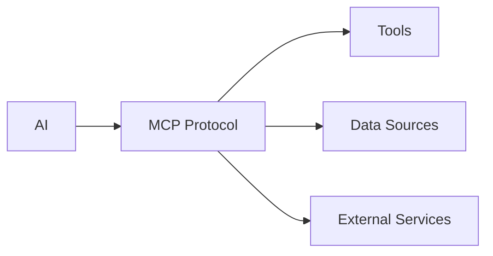

# MCP Tools Guide <Badge type="tip" text="Tools" />

Learn how to use MCP tools for extended AI capabilities.

## What is MCP? {#what-is-mcp}

**MCP (Model Context Protocol)** is an open standard that enables AI to use external tools and data sources.



## Built-in Tools {#builtin}

ChatAI Plugin includes built-in tools in **22 categories**. See [Built-in Tools](/en/tools/builtin) for the full list.

| Category | Description | Category | Description |
|:---------|:---------|:---------|:---------|
| **basic** | Time, random numbers | **search** | Web search, Wiki, translation |
| **user** | User info, friends | **utils** | Calculation, encoding |
| **group** | Group info, members | **voice** | TTS, voice recognition |
| **message** | Send/get messages | **bot** | Bot info, status |
| **admin** | Mute, kick, admin | **extra** | Weather, quotes, dice |
| **media** | Images, QR codes | **schedule** | Scheduled tasks |
| **web** | Fetch web pages | **bltools** | QQ Music, Bilibili, GitHub |
| **memory** | User memory CRUD | **imageGen** | AI image generation |
| **file** | File upload/download | **qzone** | QQ Zone moments |

## Using Tools {#using}

AI automatically uses tools when needed:

```txt
User: What time is it?
AI: [calls get_current_time] It's 2:30 PM.

User: Search for weather in Tokyo
AI: [calls web_search] Here's the weather forecast...
```

## Viewing Tool Calls {#viewing}

See what tools AI used:

```txt
#工具日志
```

Enable debug mode for detailed logs:
```txt
#ai调试开启
```

## Tool Permissions {#permissions}

Tools have different permission levels:

| Level | Who Can Use | Examples |
|:------|:------------|:---------|
| 🟢 Safe | Everyone | Time, search |
| 🟡 Medium | Members | Send messages |
| 🟠 Higher | Admins | Group management |
| 🔴 Dangerous | Masters only | Shell commands |

## Managing Tools {#managing}

### Via Web Panel {#web-panel}

1. Go to **Tools** tab
2. Enable/disable categories
3. Configure permissions

### Via Config {#config}

```yaml
builtinTools:
  enabledCategories:
    - basic
    - user
    - search
  disabledCategories:
    - shell
    - admin
```

## External MCP Servers {#external}

Add more tools via external MCP servers:

```json
// data/mcp-servers.json
{
  "servers": {
    "filesystem": {
      "command": "npx",
      "args": ["-y", "@anthropic/mcp-server-filesystem"]
    }
  }
}
```

Popular servers:
- `@anthropic/mcp-server-filesystem` - File operations
- `@anthropic/mcp-server-fetch` - Web fetching
- `@anthropic/mcp-server-github` - GitHub API

## Custom Tools {#custom}

Create your own tools in `data/tools/`:

```javascript
// data/tools/my_tool.js
export const tools = [{
  name: 'my_tool',
  description: 'My custom tool',
  handler: async (args) => {
    return { result: 'Done!' }
  }
}]
```

## MCP Status {#status}

Check MCP server status:

```txt
#mcp状态
```

## Next Steps {#next}

- [Tool Development](/en/tools/) - Create custom tools
- [MCP Configuration](/en/config/mcp) - Advanced MCP config
