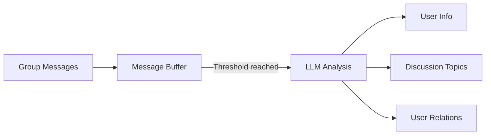

# Memory System Guide <Badge type="tip" text="Personalization" />

Long-term memory lets the AI remember user preferences and historical information for a more personalized conversation experience.

::: info 🧠 Memory System
The memory system automatically extracts user information from conversations and uses it in later conversations. Summary results use structured output: each line is `[category] content` (categories limited to profile/preference/event/relation/topic/custom; `[category:subtype]` is also supported).
:::

## Quick Start {#quick-start}

### Enable Memory

1. In the Web panel, go to **Config → Memory**
2. Turn on **Enable long-term memory**
3. Save the config

Or in the config file:

```yaml
memory:
  enabled: true
```

### Basic Usage

Once memory is enabled, the AI will automatically:

- **Extract information**: recognize the user's name, preferences, important dates, etc. from conversations
- **Store memories**: save the extracted information by category
- **Personalize replies**: use the remembered information in later conversations

::: tip Example Conversation
**User**: My name is Xiao Ming, and today is my birthday

**AI**: Happy birthday, Xiao Ming! 🎂 Hope you have a great day!

*(in the next conversation)*

**User**: Do you remember me?

**AI**: Of course I do, Xiao Ming! By the way, is your birthday coming up?
:::

## Memory Categories {#categories}

The system divides memories into six categories:

| Category | Icon | Description | Example |
|:---------|:----:|:------------|:--------|
| **Basic Information** | 👤 | Name, age, occupation, etc. | "User is Xiao Ming, 25, a programmer" |
| **Preferences & Habits** | ❤️ | Likes, dislikes, habits | "Likes games, dislikes coriander" |
| **Important Events** | 📅 | Birthdays, anniversaries, plans | "Birthday is March 15" |
| **Relationships** | 👥 | Family, friends, colleagues | "Xiao Hong is the user's good friend" |
| **Topic Interests** | 💬 | Topics of interest | "Interested in AI technology" |
| **Custom** | 🏷️ | Other information | Any custom content |

## Memory Summaries and Structured Output {#summary}

The memory summary endpoint combines "merge & deduplicate + LLM summary + (optional) low-quality cleanup" in one call:

```http
POST /api/memories/user/:userId/summarize
```

**Request Body**

```json
{
  "useLLM": true,
  "cleanup": true
}
```

| Parameter | Type | Default | Description |
|-----------|------|---------|-------------|
| `useLLM` | boolean | `true` | Whether to use an LLM for the summary |
| `cleanup` | boolean | `true` | Whether to run low-quality memory cleanup after summarizing (skipped when `cleanup === false` / `'false'`, preserving the existing call semantics) |
| `groupId` | string | - | Restrict to a group |
| `model` | string | - | Specify the summary model |

### Structured Output Format

LLM summary results are parsed line by line into the store; each line strictly follows `[category] content` (category whitelist: `profile` / `preference` / `event` / `relation` / `topic` / `custom`):

```
[profile] User is a software engineer
[preference] Likes iced Americano
[event] Joined a new company in March 2026
```

Parsing rules:

- Normalized lines with a `[category]` prefix are stored directly (categories validated against the whitelist);
- Free-text lines are only stored after stripping old-format prefixes and passing a triple filter (leading reasoning-word list / reasoning-word density / meta-narrative sentence patterns). Reasoning and explanatory text output by the model never enters memories.

### Cleanup Endpoint

```http
POST /api/memories/user/:userId/cleanup
```

Cleans up the user's low-quality memories (low confidence / expired / too old / too short). Can be called separately without triggering an LLM summary.

## Managing Memories {#manage}

### Commands {#commands}

::: code-group
```bash [View Memories]
#ai查看记忆
```

```bash [Clear Memories]
#ai清除记忆
```

```bash [Add Memory (master)]
#ai添加记忆 @user likes pizza
```
:::

### Web Panel

1. Open the group management page
2. Select the target group
3. Click the **Memory Management** tab

From there you can:
- View the user memory list
- Filter memories by category
- Edit or delete individual memories
- Batch-clean memories

## Group Chat Context

The group chat context feature automatically collects and analyzes group chat information:

```yaml
memory:
  groupContext:
    enabled: true
    collectInterval: 10       # Collect every 10 minutes
    analyzeThreshold: 20      # Trigger analysis after 20 messages
    extractUserInfo: true     # Extract user info
    extractTopics: true       # Extract discussion topics
    extractRelations: true    # Extract user relations
```

### How It Works



### Extracted Content

- **User info**: nickname preferences, speaking style, active hours
- **Discussion topics**: trending topics in the group, user interests
- **User relations**: who is friends with whom, who interacts often

## Summary Push

Scheduled group chat summaries help members catch up on what they missed:

```yaml
memory:
  summaryPush:
    enabled: true
    defaultPushHour: 22       # Push at 22:00 every day
    maxMessages: 300          # Analyze at most 300 messages
    useLLM: true              # Use AI to generate the summary
```

### Example Output

```
📊 Today's Group Chat Summary

📌 Main Topics
• Discussed the plan for releasing the new version
• Shared photos from the weekend activity
• Technical discussion: Python async programming

👥 Active Members
Xiao Ming (50 msgs), Xiao Hong (35 msgs), Xiao Hua (28 msgs)

💬 Highlights
"This approach is 3x more efficient than the previous one" - Xiao Ming
```

## Memory Model

You can specify a model dedicated to memory extraction:

```yaml
memory:
  model: "gpt-4o-mini"  # Use a cheaper model for memory processing
```

::: tip Suggestion
Memory extraction does not need the strongest model; `gpt-4o-mini` or `claude-3-haiku` is enough and saves cost.
:::

## Privacy & Security

### Memory Scope

- **Personal memories**: only the user's own conversations are remembered
- **Group memories**: group chat information is only used in that group
- **Data isolation**: memories of different groups/users are fully isolated

### User Control

Users can at any time:
- View their own memories
- Delete specific memories
- Clear all memories

### Sensitive Information

The system does not extract or store:
- Passwords, API keys, etc.
- Bank card numbers, ID card numbers
- Private chat content

## Config Reference

### Full Configuration

```yaml
memory:
  # Basic settings
  enabled: true
  storage: database
  maxMemories: 50

  # Auto extraction
  autoExtract: true
  pollInterval: 5
  minPollInterval: 30   # Minimum interval (minutes) between two polled summaries for a conversation target; defaults to 30 when unset
  model: ""

  # Group chat context
  groupContext:
    enabled: true
    collectInterval: 10
    maxMessagesPerCollect: 50
    analyzeThreshold: 20
    extractUserInfo: true
    extractTopics: true
    extractRelations: true

  # Summary push
  summaryPush:
    enabled: false
    checkInterval: 58
    defaultInterval: 1
    defaultPushHour: 22
    maxMessages: 300
    useLLM: true
    groups: {}
    intervalType: hour

  # Summary model
  summaryModel: ""
```

### Parameter Reference

| Parameter | Type | Default | Description |
|:----------|:-----|:--------|:------------|
| `enabled` | boolean | `false` | Enable the memory system |
| `storage` | string | `database` | Storage method |
| `maxMemories` | number | `50` | Max memories per user |
| `autoExtract` | boolean | `true` | Extract memories automatically |
| `pollInterval` | number | `5` | Extraction interval (minutes) |
| `minPollInterval` | number | `30` | Minimum interval (minutes) between two polled summaries for a conversation target; read dynamically in code |
| `model` | string | `""` | Extraction model (empty = default) |

## Best Practices

### 1. Set a Reasonable Memory Count

```yaml
memory:
  maxMemories: 30  # Too many can hurt conversation quality
```

### 2. Use an Economical Model

```yaml
memory:
  model: "gpt-4o-mini"
  summaryModel: "gpt-4o-mini"
```

### 3. Enable Features Selectively

```yaml
memory:
  groupContext:
    extractUserInfo: true   # Enable
    extractTopics: false    # Disable what you don't need
    extractRelations: false
```

## Troubleshooting

### Memory Not Working

1. Check whether it is enabled: `memory.enabled: true`
2. Check whether an API channel is available
3. Check the logs for errors

### Inaccurate Extraction

1. Try a different extraction model
2. Check whether the conversation content is clear enough
3. Manually add important memories

### Too Many Memories

```bash
# Clean up old memories
#ai清除记忆
```

## Next Steps

- [Memory Config](/config/memory) - Detailed configuration options
- [Memory Architecture](/architecture/memory) - Technical implementation
- [Trigger Guide](/guide/triggers) - Configure trigger methods