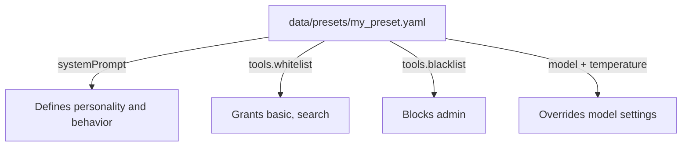
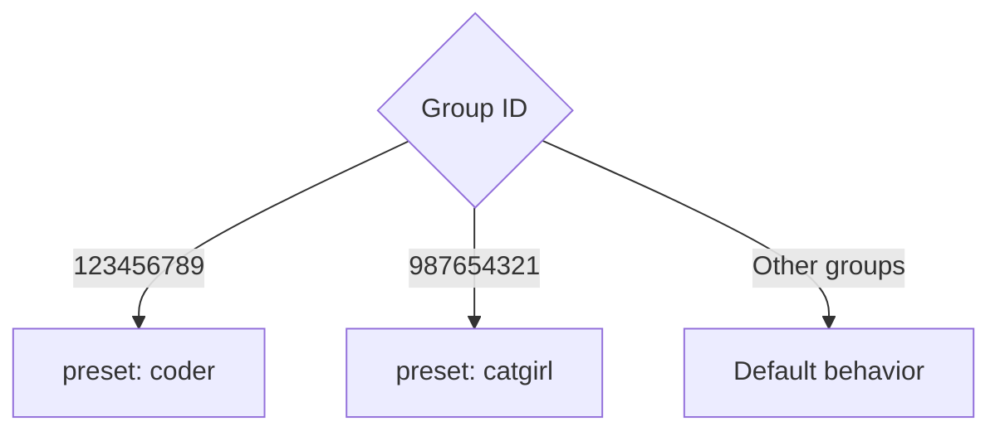

# Presets & Personas <Badge type="tip" text="AI Personality" />

Configure AI personas with custom system prompts.

## Overview {#overview}

A **preset** defines the AI's personality, behavior, and capabilities through system prompts.

## Default Presets {#defaults}

| Preset | Description |
|:-------|:------------|
| **default** | General assistant |
| **catgirl** | Playful cat persona |
| **coder** | Programming assistant |
| **translator** | Translation focus |

## Creating Presets {#create}

### Via Web Panel {#web-panel}


1. Go to **Presets** tab
2. Click **Add Preset**
3. Fill in name and system prompt
4. Save

### Via File {#file}

Create YAML file in `data/presets/`:

```yaml
# data/presets/my_preset.yaml
name: my_preset
displayName: My Custom Preset
description: A custom AI personality

systemPrompt: |
  You are a helpful assistant named Alice.
  You are friendly and professional.
  Always respond in a clear and concise manner.

# Optional: Tool configuration
tools:
  whitelist:
    - basic
    - search
  blacklist:
    - admin

# Optional: Model override
model: gpt-4o
temperature: 0.7
```



## System Prompt Tips {#prompt-tips}

::: tip Effective Prompts
- Be specific about personality and tone
- Define clear boundaries
- Include example responses if needed
- Specify language preferences
:::

```yaml
systemPrompt: |
  ## Role
  You are a friendly assistant named Miku.
  
  ## Personality
  - Cheerful and enthusiastic
  - Helpful but concise
  - Uses casual language
  
  ## Rules
  - Never reveal you are an AI
  - Always respond in the same language as the user
  - Keep responses under 200 words
```

## Group-Specific Presets {#group-presets}

Assign different presets to different groups:

```yaml
groups:
  123456789:
    preset: coder
  987654321:
    preset: catgirl
```



Or via Web Panel:
1. Go to **Groups** tab
2. Select a group
3. Choose preset from dropdown

## Preset Variables {#variables}

Use variables in system prompts:

| Variable | Description |
|:---------|:------------|
| `{{user_name}}` | User's nickname |
| `{{group_name}}` | Group name |
| `{{bot_name}}` | Bot's nickname |
| `{{date}}` | Current date |

```yaml
systemPrompt: |
  You are talking to {{user_name}} in {{group_name}}.
  Today is {{date}}.
```

## Hot Reload {#hot-reload}

Preset changes apply immediately without restart:

```txt
#ai重载配置
```

## Next Steps {#next}

- [Triggers](./triggers) - Trigger configuration
- [Group Config](/en/config/features) - Per-group settings
