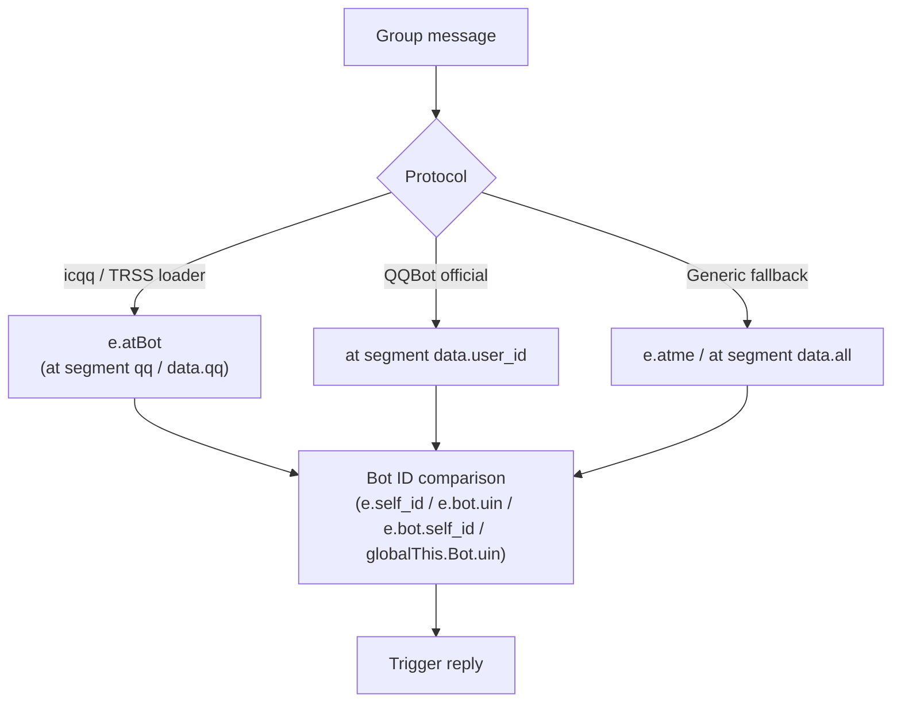
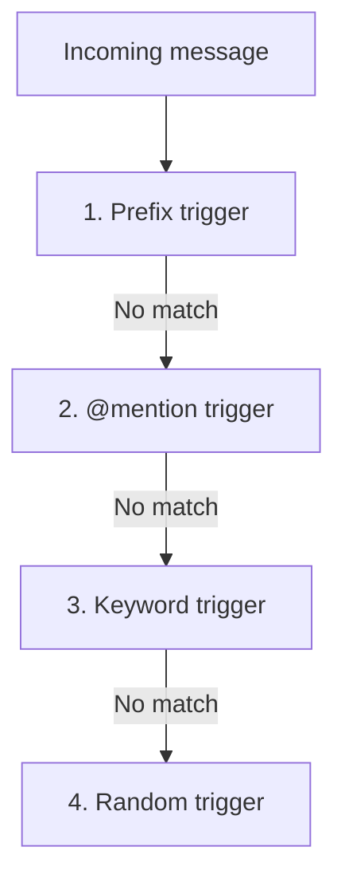

# Trigger Configuration <Badge type="tip" text="Triggers" />

Configure how users activate AI conversations.

## Trigger Types {#types}

| Type | Description | Example |
|:-----|:------------|:--------|
| **at** | @mention the bot | `@bot hello` |
| **prefix** | Command prefix | `#chat hello` |
| **keyword** | Contains keyword | `ai help me` |
| **random** | Random probability | Any message (5% chance) |
| **always** | Always respond | Every message |

## Configuration {#config}

### Basic Config {#basic}

```yaml
trigger:
  # Private chat trigger
  private: always
  
  # Group chat trigger
  group: at
  
  # Command prefix (for prefix mode)
  prefix: "#chat"
```

### Multiple Triggers {#multiple}

```yaml
trigger:
  group:
    - at
    - prefix
  prefix: "#ai"
  keywords:
    - "帮我"
    - "请问"
```

## Private Chat {#private}

| Mode | Behavior |
|:-----|:---------|
| `always` | Respond to all messages |
| `prefix` | Only respond to prefixed messages |
| `none` | Disable private chat |

## Group Chat {#group}

| Mode | Behavior |
|:-----|:---------|
| `at` | Respond when @mentioned |
| `prefix` | Respond to prefixed messages |
| `keyword` | Respond when keywords detected |
| `random` | Random chance to respond |
| `atAll` | Respond to @all |

### At-Mention Detection Across Protocols {#at-protocols}

The at trigger in group chats covers the major protocols in `apps/chat.js` (`checkTrigger`), no extra configuration needed:



| Protocol | Detection fields | Notes |
|:---------|:-----------------|:------|
| icqq / TRSS loader | `e.atBot` + at segment `qq` / `data.qq` | The loader normalizes at mentions into `e.atBot` |
| QQBot official | at segment `data.user_id` | Official events have no `atBot` field |
| Generic fallback | `e.atme`, at segment `data.all` (@all) | @all counts as a mention |

The bot ID comparison uses the chain `e.self_id → e.bot.uin → e.bot.self_id → globalThis.Bot.uin` with string-based soft comparison. A pure @mention with no text does not trigger a reply; if the cleaned text is empty but the original message was not, the original text is used.

## Keyword Trigger {#keyword}

```yaml
trigger:
  group: keyword
  keywords:
    - "ai"
    - "机器人"
    - "帮我"
  keywordMode: contains  # or "startsWith", "exact"
```

## Random Trigger {#random}

```yaml
trigger:
  group: random
  randomRate: 0.05  # 5% chance
```

## Per-Group Override {#per-group}

```yaml
groups:
  123456789:
    trigger:
      mode: prefix
      prefix: "#gpt"
  987654321:
    trigger:
      mode: at
```

## Web Panel {#web-panel}

Configure triggers visually:

1. Go to **Groups** tab
2. Select a group
3. Configure trigger settings
4. Save

## Priority {#priority}

When multiple triggers are enabled:



1. Prefix trigger (highest)
2. @mention trigger
3. Keyword trigger
4. Random trigger (lowest)

## Next Steps {#next}

- [Presets](./presets) - AI personas
- [Group Config](/en/config/features) - Group settings
