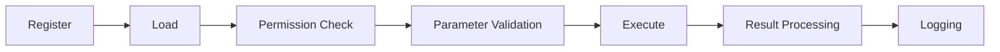

# Advanced Tool Development <Badge type="warning" text="Advanced" />

This document covers advanced techniques and best practices for tool development.

::: tip 📖 Prerequisites
Read [Custom JS Tools](./custom-js) for the basics before reading this document.
:::

## Tool Lifecycle {#lifecycle}



### Initialization Hooks

```javascript
export default {
  name: 'my_tool',
  description: 'My tool',

  // Called when the tool is loaded
  async onLoad() {
    console.log('[my_tool] Tool loaded')
    // Initialize resources, connections, etc.
  },

  // Called when the tool is unloaded
  async onUnload() {
    console.log('[my_tool] Tool unloaded')
    // Clean up resources
  },

  inputSchema: { type: 'object', properties: {} },
  handler: async (args) => ({ result: 'ok' })
}
```

## Advanced Parameter Validation

### Custom Validators

```javascript
export default {
  name: 'advanced_tool',
  description: 'Advanced parameter validation example',

  inputSchema: {
    type: 'object',
    properties: {
      email: {
        type: 'string',
        description: 'Email address',
        pattern: '^[^@]+@[^@]+\\.[^@]+$'
      },
      age: {
        type: 'integer',
        minimum: 0,
        maximum: 150
      },
      tags: {
        type: 'array',
        items: { type: 'string' },
        minItems: 1,
        maxItems: 10
      }
    },
    required: ['email']
  },

  // Extra validation logic
  validate(args) {
    if (args.email && args.email.includes('spam')) {
      throw new Error('Disallowed email domain')
    }
    return true
  },

  handler: async (args) => {
    return { success: true }
  }
}
```

### Conditional Required Fields

```javascript
inputSchema: {
  type: 'object',
  properties: {
    type: { type: 'string', enum: ['file', 'url'] },
    filePath: { type: 'string' },
    url: { type: 'string' }
  },
  required: ['type'],
  // Decide other required fields based on type
  if: { properties: { type: { const: 'file' } } },
  then: { required: ['type', 'filePath'] },
  else: { required: ['type', 'url'] }
}
```

## Context Access

### Full Context API

```javascript
export default {
  name: 'context_demo',
  description: 'Context access example',

  inputSchema: { type: 'object', properties: {} },

  handler: async (args, context) => {
    const api = context.getApi()

    // Event info
    const event = context.getEvent()
    const userId = event?.user_id
    const groupId = event?.group_id
    const messageId = event?.message_id

    // Permission info
    const isMaster = context.isMaster()

    return {
      userId,
      groupId,
      isMaster,
      isAdmin
    }
  }
}
```

### Sending Messages

```javascript
handler: async (args, context) => {
  const api = context.getApi()
  const event = context.getEvent()

  // Reply to the current message
  await api.reply('Done')

  // Send to a specific group
  await api.sendGroup('123456', 'Group message')

  // Send a private message
  await api.sendPrivate('789', 'Private message')

  // Send an image
  await api.reply(context.message.image('/path/to/image.png'))

  // Send a merged forward message
  const msgs = [
    { message: 'Message 1' },
    { message: 'Message 2' }
  ]
  await api.sendForward({ nodes: msgs })

  return { success: true }
}
```

## Async & Streaming

### Long-Running Tasks

```javascript
export default {
  name: 'long_task',
  description: 'Long-running task',

  // Mark as a long-running task
  longRunning: true,

  inputSchema: { type: 'object', properties: {} },

  handler: async (args) => {
    const api = context.getApi()

    // Send a progress notification
    await api.reply('Task started, please wait...')

    // Run the time-consuming operation
    const result = await heavyComputation()

    // Completion notification
    await api.reply('Task completed!')

    return { result }
  }
}
```

### Timeout Control

```javascript
export default {
  name: 'timeout_demo',
  description: 'Timeout control example',

  // Set the timeout (milliseconds)
  timeout: 30000,

  inputSchema: { type: 'object', properties: {} },

  handler: async (args) => {
    const controller = new AbortController()
    const timeoutId = setTimeout(() => controller.abort(), 25000)

    try {
      const result = await fetch('https://api.example.com/slow', {
        signal: controller.signal
      })
      return await result.json()
    } finally {
      clearTimeout(timeoutId)
    }
  }
}
```

## Permission Control

### Permission Flags

```javascript
export default {
  name: 'admin_tool',
  description: 'Admins only',

  // Permission flags
  adminOnly: true,        // Admins only
  masterOnly: false,      // Masters only
  dangerous: false,       // Dangerous operation
  groupOnly: true,        // Group chats only
  privateOnly: false,     // Private chats only

  inputSchema: { type: 'object', properties: {} },
  handler: async (args) => ({ result: 'ok' })
}
```

### Custom Permission Checks

```javascript
export default {
  name: 'custom_permission',
  description: 'Custom permission check',

  // Custom permission check function
  checkPermission(ctx) {
    const event = ctx.getEvent()

    // Check against a group whitelist
    const allowedGroups = ['123456', '789012']
    if (!allowedGroups.includes(event?.group_id)) {
      return { allowed: false, reason: 'This group is not authorized to use this tool' }
    }

    // Check user level
    const userLevel = getUserLevel(event?.user_id)
    if (userLevel < 5) {
      return { allowed: false, reason: 'Users below level 5 are not allowed' }
    }

    return { allowed: true }
  },

  inputSchema: { type: 'object', properties: {} },
  handler: async (args) => ({ result: 'ok' })
}
```

## Error Handling

### Error Types

```javascript
// Define a custom error
class ToolError extends Error {
  constructor(message, code, recoverable = false) {
    super(message)
    this.code = code
    this.recoverable = recoverable
  }
}

export default {
  name: 'error_handling',
  description: 'Error handling example',

  inputSchema: {
    type: 'object',
    properties: {
      action: { type: 'string' }
    }
  },

  handler: async (args) => {
    try {
      const result = await performAction(args.action)
      return { success: true, result }
    } catch (error) {
      // Recoverable error: return an error message so the AI can retry
      if (error.recoverable) {
        return {
          error: true,
          message: error.message,
          suggestion: 'Please try other parameters'
        }
      }

      // Non-recoverable error: rethrow
      throw error
    }
  }
}
```

### Retry Mechanism

```javascript
async function withRetry(fn, maxRetries = 3, delay = 1000) {
  for (let i = 0; i < maxRetries; i++) {
    try {
      return await fn()
    } catch (error) {
      if (i === maxRetries - 1) throw error
      await new Promise(r => setTimeout(r, delay * (i + 1)))
    }
  }
}

export default {
  name: 'retry_demo',

  handler: async (args) => {
    return await withRetry(async () => {
      const response = await fetch('https://api.example.com/data')
      if (!response.ok) throw new Error('API request failed')
      return response.json()
    })
  }
}
```

## Tool Composition

### Calling Other Tools

```javascript
import { SkillsAgent } from '../../src/services/agent/SkillsAgent.js'

export default {
  name: 'composite_tool',
  description: 'Compose multiple tools',

  inputSchema: {
    type: 'object',
    properties: {
      city: { type: 'string' }
    }
  },

  handler: async (args, context) => {
    const agent = await createSkillsAgent({ event: context.getEvent(), bot: context.getApi().bot })

    // Call multiple tools in parallel
    const [weather, time] = await Promise.all([
      agent.execute('get_weather', { city: args.city }),
      agent.execute('get_current_time', { timezone: 'Asia/Shanghai' })
    ])

    return {
      city: args.city,
      weather: weather.text,
      time: time.text
    }
  }
}
```

## State Management

### Persistent State

```javascript
import { databaseService } from '../../src/services/storage/DatabaseService.js'

export default {
  name: 'stateful_tool',
  description: 'A tool with state',

  inputSchema: {
    type: 'object',
    properties: {
      action: { type: 'string', enum: ['get', 'set', 'increment'] },
      key: { type: 'string' },
      value: { type: 'string' }
    }
  },

  handler: async (args) => {
    const db = databaseService.db
    const { action, key, value } = args

    switch (action) {
      case 'get':
        const row = db.prepare('SELECT value FROM tool_state WHERE key = ?').get(key)
        return { value: row?.value }

      case 'set':
        db.prepare('INSERT OR REPLACE INTO tool_state (key, value) VALUES (?, ?)')
          .run(key, value)
        return { success: true }

      case 'increment':
        db.prepare(`
          INSERT INTO tool_state (key, value) VALUES (?, 1)
          ON CONFLICT(key) DO UPDATE SET value = value + 1
        `).run(key)
        const result = db.prepare('SELECT value FROM tool_state WHERE key = ?').get(key)
        return { value: result.value }
    }
  }
}
```

## Testing Tools

### Unit Tests

```javascript
// tests/my_tool.test.js
import { describe, it, expect } from 'vitest'
import myTool from '../data/tools/my_tool.js'

describe('my_tool', () => {
  it('should return correct result', async () => {
    const result = await myTool.handler({ name: 'test' })
    expect(result.success).toBe(true)
  })

  it('should validate input', () => {
    expect(() => myTool.validate({ invalid: true })).toThrow()
  })
})
```

### Integration Tests

```javascript
import { SkillsAgent } from '../src/services/agent/SkillsAgent.js'

describe('tool integration', () => {
  it('should work with SkillsAgent', async () => {
    const agent = new SkillsAgent({ userId: 'test' })
    await agent.init()

    const result = await agent.execute('my_tool', { name: 'test' })
    expect(result).toBeDefined()
  })
})
```

## Best Practices

### 1. Naming Conventions

```javascript
// ✅ Good names
'get_user_info'
'web_search'
'send_notification'

// ❌ Avoid
'tool1'
'myFunction'
'do_stuff'
```

### 2. Clear Descriptions

```javascript
// ✅ Good description
description: 'Query the real-time weather by city name; returns temperature, humidity, and conditions'

// ❌ Avoid
description: 'check weather'
```

### 3. Consistent Return Structure

```javascript
// ✅ Consistent return structure
return { success: true, data: result, text: 'Human-readable result' }
return { success: false, error: message }

// ❌ Avoid inconsistency
return result
return { ok: true }
return 'string result'
```

### 4. Resource Cleanup

```javascript
handler: async (args) => {
  const resource = await acquireResource()
  try {
    return await useResource(resource)
  } finally {
    await resource.close()  // Guarantee cleanup
  }
}
```

## Next Steps

- [Custom JS Tools](./custom-js) - Basic tutorial
- [MCP Server](./mcp-server) - Connect external services
- [Security & Permissions](./security) - Permission configuration