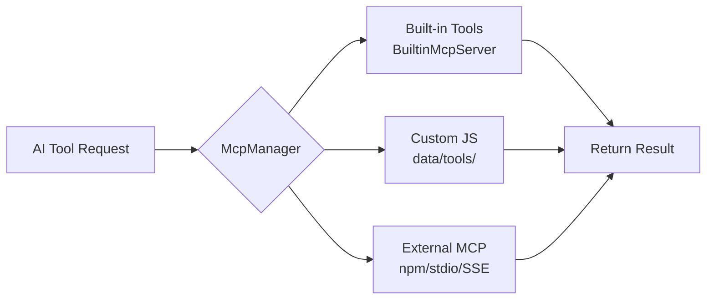
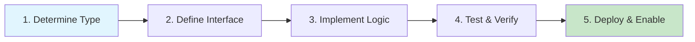

# Tool Development Overview <Badge type="tip" text="MCP" />

ChatAI Plugin implements its tool system based on **MCP (Model Context Protocol)** standard, supporting three tool sources.

## Tool Sources {#tool-sources}

::: info Three Tool Sources
Choose the appropriate development method based on your needs, from simple to complex: Custom JS → Built-in Tools → External MCP
:::

| Source | Location | Description | Hot Reload |
|:-------|:---------|:------------|:----------:|
| **Built-in Tools** | `src/mcp/tools/` | Core functionality, 20 categorized modules | ✅ |
| **Custom JS** | `data/tools/` | User scripts, no source code modification needed | ✅ |
| **External MCP** | `data/mcp-servers.json` | npm packages or remote servers | ❌ |



## Tool Definition Format {#tool-format}

All tools follow the **MCP standard** unified definition format:

```javascript{2,5,8-18,21-24}
{
  // Tool name (unique identifier, snake_case format)
  name: 'my_tool',
  
  // Tool description (visible to AI, clear description helps AI call correctly)
  description: 'Tool function description, explain when to use and parameter meanings',
  
  // Parameter definition (JSON Schema format)
  inputSchema: {
    type: 'object',
    properties: {
      param1: {
        type: 'string',
        description: 'Parameter description'
      }
    },
    required: ['param1']
  },
  
  // Handler function (async)
  handler: async (args) => {
    // Implementation logic
    return { result: '...' }
  }
}
```

## Context Access {#context-access}

Built-in tools access runtime context through `ToolContext` to get Bot, event, permissions info.

::: tip ToolContext API
`ToolContext` is the core context object during tool execution, defined in `src/mcp/BuiltinMcpServer.js`
:::

```javascript{1,4,7-9,12,15-16}
import { getBuiltinToolContext } from '../../mcp/BuiltinMcpServer.js'

handler: async (args) => {
  const ctx = getBuiltinToolContext()
  
  // Get Bot instance (handles multi-Bot environment automatically)
  const bot = ctx.getBot()
  // Support specifying Bot ID
  const specificBot = ctx.getBot(botId)
  
  // Get message event
  const event = ctx.getEvent()
  const userId = event?.user_id
  const groupId = event?.group_id
  
  // Check if master
  const isMaster = ctx.isMaster
  
  // Get adapter info
  const adapter = ctx.getAdapter()
  // Returns: { adapter: 'icqq'|'napcat'|'onebot', isNT: boolean, canAiVoice: boolean }
  
  // Shortcut methods
  ctx.isIcqq()    // Is ICQQ adapter
  ctx.isNapCat()  // Is NapCat adapter
  ctx.isNT()      // Supports NT features
  
  // Get Bot permission in group
  const permission = await ctx.getBotPermission(groupId)
  // Returns: { role: 'owner'|'admin'|'member', isAdmin: boolean, isOwner: boolean, inGroup: boolean }
}
```

## Return Format {#return-format}

Tool return values are automatically serialized and returned to AI:

::: code-group
```javascript [Simple Text]
return { text: 'Result text' }
```

```javascript [Structured Data]
return { 
  success: true,
  data: { key: 'value' }
}
```

```javascript [With Extra Info]
return {
  text: 'Current time: 14:30',
  datetime: '2024-12-15T06:30:00.000Z',
  timestamp: 1702622400000
}
```

```javascript [Error Handling]
// Method 1: Throw error
throw new Error('Operation failed: Permission denied')

// Method 2: Return error object
return { error: true, message: 'Operation failed' }
```
:::

::: warning Return Value Notes
- Return values should be concise, avoid returning large amounts of irrelevant data
- `text` field will be shown directly to AI, should be human-readable format
- Structured data is suitable for scenarios requiring further processing
:::

## Development Workflow {#dev-workflow}



| Step | Description | Key Points |
|:-----|:------------|:-----------|
| **1. Determine Type** | Choose built-in/custom/MCP | Use custom JS for simple features, built-in for complex |
| **2. Define Interface** | Name, description, parameters | Clear description, use JSON Schema for params |
| **3. Implement Logic** | Write handler function | Handle exceptions and check permissions |
| **4. Test & Verify** | API test or conversation test | Use `#工具日志` to view call details |
| **5. Deploy & Enable** | Configure permissions and enable | Manage tool enable status via Web panel |

## Detailed Documentation {#detailed-docs}

::: tip 📚 Choose the Right Development Method
:::

| Document | Use Case | Difficulty |
|:---------|:---------|:----------:|
| [Built-in Tools](./builtin) | Deep integration, access internal APIs | ⭐⭐⭐ |
| [Custom JS Tools](./custom-js) | Quick development, no source modification | ⭐ |
| [MCP Server](./mcp-server) | External services, reuse existing MCP | ⭐⭐ |
| [Security](./security) | Understand tool security mechanisms | ⭐⭐ |
