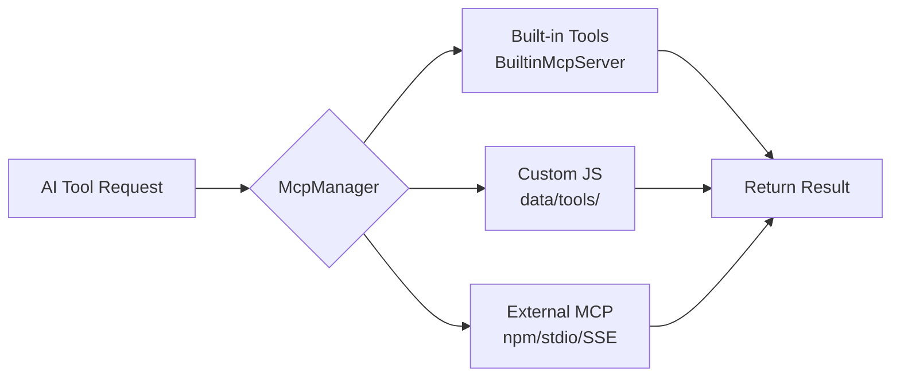

# Tool Development Overview <Badge type="tip" text="MCP" />

ChatAI Plugin implements its tool system based on **MCP (Model Context Protocol)** standard, supporting three tool sources.

## Tool Sources {#tool-sources}

::: info Three Tool Sources
Choose the appropriate development method based on your needs, from simple to complex: Custom JS → Built-in Tools → External MCP
:::

| Source | Location | Description | Hot Reload |
|:-------|:---------|:------------|:----------:|
| **Built-in Tools** | `src/mcp/tools/` | Core functionality, 25 categorized modules | ✅ |
| **Custom JS** | `data/tools/` | User scripts, no source code modification needed | ✅ |
| **External MCP** | `data/mcp-servers.json` | npm packages or remote servers | ❌ |


```mermaid
graph LR
    A[AI Tool Request] --> B{McpManager}
    B --> C[Built-in Tools<br/>BuiltinMcpServer]
    B --> D[Custom JS<br/>data/tools/]
    B --> E[External MCP<br/>npm/stdio/SSE]
    C --> F[Return Result]
    D --> F
    E --> F
```

## Skills File System {#skills-files}

In addition to the three tool sources above, the system also supports loading skill documents from the `data/skills` directory:

| File Format | Description | Auto Activation |
|-------------|-------------|:---------------:|
| `SKILL.md` | Markdown frontmatter + instruction body | Per `autoActivate` config |
| `*.skill.yaml` | YAML skill definition | Per `autoActivate` config |
| `*.skill.json` | JSON skill definition | Per `autoActivate` config |

### Skill Loading Mechanism

1. **Default exposure**: all skill files are scanned at startup, exposing only the skill list (name + description)
2. **Explicit loading**: the model requests the full skill content through the `load_skill` tool
3. **Auto injection**: skills with `autoActivate: true` are injected automatically at conversation start
4. **Context reload**: already-loaded skills are re-injected after context compression

### Scan Paths

The following directories are scanned by default:
- `data/skills/` - primary skill directory
- `.cursor/skills/` - IDE skill directory
- `.claude/skills/` - Claude Code skill directory
- `.codex/skills/` - Codex skill directory

## Skills Config File {#skills-yaml}

The full Skills module configuration lives in `data/skills.yaml` (loaded and validated by `src/services/skills/SkillsConfig.js`), decoupled from the MCP server config. The file is auto-created with defaults when missing and supports hot reload (`hasChanged()` detects mtime changes, then `reload()`). All configuration sits under the top-level `skills` key.

### Top-level Structure {#skills-yaml-overview}

```yaml
skills:
  enabled: true          # Whether the Skills module is enabled
  mode: 'hybrid'         # Working mode: hybrid / skills-only / mcp-only
  sources: {...}         # Tool source config
  groups: [...]          # Tool group config
  execution: {...}       # Tool execution config
  dispatch: {...}        # Dispatch config (lightweight model pre-selects tool groups)
  documents: {...}       # SKILL.md document skill config
  security: {...}        # Dangerous tool security config
```

### Working Mode `mode` {#skills-yaml-mode}

| Value | Description |
|:------|:------------|
| `hybrid` | **Default**. Loads both Skills-configured tools (built-in + custom JS) and MCP server tools |
| `skills-only` | Loads only Skills-configured tools and ignores MCP servers (`isMcpEnabled()` returns `false`) |
| `mcp-only` | Loads only MCP server tools and ignores built-in and custom JS tools (legacy behavior) |

::: info Invalid value fallback
`mode` accepts only the three values above; any other value triggers a validation-time warning and falls back to `hybrid`.
:::

### Tool Sources `sources` {#skills-yaml-sources}

The three tool sources can be enabled/disabled independently, each keeping its own disabled-tool list:

```yaml
sources:
  builtin:                 # Built-in tools
    enabled: true
    categories: []         # Enabled category list (empty array = enable all)
    disabledTools: []      # Disabled tools (takes precedence over categories)
  custom:                  # Custom JS tools
    enabled: true
    path: 'data/tools'     # JS tool directory (relative to the plugin root)
    autoReload: true       # Auto reload on file changes
  mcp:                     # External MCP server tools
    enabled: true
    servers: []            # Enabled server list
    disabledServers: []    # Disabled server list
```

::: tip disabledTools merge
`getDisabledTools()` deduplicates and merges the `disabledTools` of the `builtin`, `custom`, and `mcp` sources; a tool disabled by any source is disabled globally.
:::

### Tool Groups `groups` {#skills-yaml-groups}

`groups` divides tools into logical groups for dispatch and permission management. User-configured `groups` **completely replace** the defaults (no merging).

```yaml
groups:
  - index: 0                    # Group index (unique)
    name: 'basic'               # Group name (unique)
    description: 'Basic tools: time, date, lunar date, festivals, system environment info, etc.'
    tools: ['get_current_time', 'get_lunar_date', ...]  # Tool name list
    enabled: true               # Whether this group is enabled
  - index: 6
    name: 'admin'
    description: 'Group admin: mute, kick, set group card/title, send announcements, etc.'
    tools: ['mute_member', 'kick_member', ...]
    enabled: true
    requiredPermission: 'admin' # Permission required for this group (optional)
  - index: 17
    name: 'shell'
    description: 'System commands (dangerous tools)'
    tools: ['execute_command', 'get_system_info', ...]
    enabled: false              # Dangerous group disabled by default
    requiredPermission: 'master'
```

| Field | Type | Description |
|:------|:-----|:------------|
| `index` | `number` | Group index, retrievable via `getGroupByIndex()` |
| `name` | `string` | Group name, retrievable via `getGroupByName()`; warns when missing |
| `description` | `string` | Group description |
| `tools` | `string[]` | Tool name list of the group; reset to `[]` when not an array |
| `enabled` | `boolean` | Whether enabled; `getEnabledGroups()` filters `enabled !== false` |
| `requiredPermission` | `string` | Permission required for this group (e.g. `admin`, `master`), optional |

### Document Skills `documents` {#skills-yaml-documents}

Controls scanning and injection behavior of document skills like `SKILL.md` (see [Skills File System](#skills-files)):

```yaml
documents:
  enabled: true
  mode: 'auto'                  # auto / all / explicit
  paths:                        # Directory scan list
    - 'data/skills'
    - '.cursor/skills'
    - '.claude/skills'
    - '.codex/skills'
  maxDepth: 6                   # Max directory recursion depth
  maxFileBytes: 65536           # Max bytes per skill file (reset to 1024 when < 1024)
  maxPromptChars: 20000         # Max chars injected into the system prompt (reset to 1000 when < 1000)
```

| `mode` | Matching Behavior |
|:-------|:------------------|
| `auto` | **Default**. Matches skills by name/description/relativePath/triggers against the context text |
| `all` | Injects all skills when none are explicitly specified |
| `explicit` | Injects only the skills explicitly selected in `selectedNames` |

::: warning Invalid value fallback
When `mode` is not `auto`/`all`/`explicit`, the default is restored; non-array `paths` and `maxDepth < 0` also restore defaults.
:::

### Execution Config `execution` {#skills-yaml-execution}

```yaml
execution:
  timeout: 30000        # Per-tool timeout (milliseconds); reset to 1000 when < 1000
  maxParallel: 5        # Max parallelism; reset to 1 when < 1, to 20 when > 20
  retryOnError: false   # Whether to retry on error
  maxRetries: 2         # Retry count
  cacheResults: true    # Whether to cache results
  cacheTTL: 60000       # Cache TTL (milliseconds)
```

### Dispatch Config `dispatch` {#skills-yaml-dispatch}

When enabled, a lightweight model first decides which tool groups are needed, reducing token cost:

```yaml
dispatch:
  enabled: false        # Disabled by default; can be enabled in the admin panel
  useSummary: true      # Use tool group summaries in the decision
  maxGroups: 3          # Max tool groups to select
```

### Security Config `security` {#skills-yaml-security}

```yaml
security:
  dangerousTools:               # Dangerous tool list
    - kick_member
    - mute_member
    - recall_message
    - write_file
    - delete_file
    - execute_command
  allowDangerous: false         # Whether dangerous tools may execute
  dangerousRequiredPermission: 'master'  # Permission required for dangerous tools
```

::: tip Relationship to tool approval
`security.dangerousTools` affects the risk classification of [tool approval](./security#tool-approval): tools matching the list are rated high risk. Executing dangerous tools must additionally satisfy the `allowDangerous` and `dangerousRequiredPermission` constraints.
:::

## Tool Definition Format {#tool-format}

All tools follow the **MCP standard** unified definition format:

```javascript{2,5,8-18,21-24}
{
  // Tool name (unique identifier, snake_case format)
  name: 'my_tool',
  
  // Tool description (visible to AI, clear description helps AI call correctly)
  description: 'Tool function description, explain when to use and parameter meanings',
  
  // Parameter definition (JSON Schema format)
  inputSchema: {
    type: 'object',
    properties: {
      param1: {
        type: 'string',
        description: 'Parameter description'
      }
    },
    required: ['param1']
  },
  
  // Handler function (async)
  handler: async (args) => {
    // Implementation logic
    return { result: '...' }
  }
}
```

## Context Access {#context-access}

Tools access runtime context through the second argument `context` of the handler function. Platform differences, target ID types, send-result validation, and fallbacks for unsupported capabilities are all handled by the standard interface.

::: tip ToolContext API
`context` is a request-scoped object; tools created by the model must not import runtime singletons or read protocol-side objects directly.
:::

```javascript{1,4,7-9,12,15-16}
handler: async (args, context) => {
  const api = context.getApi()
  const message = context.message
  const event = context.getEvent()
  const userId = event?.user_id
  const groupId = event?.group_id

  // Check whether the sender is the master
  const isMaster = context.isMaster()

  // Send/query through the standard interface; do not branch on QQBot, ICQQ, or OneBot inside tools
  const permission = await api.getBotPermission(groupId)
  // Returns: { role: 'owner'|'admin'|'member', isAdmin: boolean, isOwner: boolean, inGroup: boolean }
}
```

## Return Format {#return-format}

Tool return values are automatically serialized and returned to AI:

::: code-group
```javascript [Simple Text]
return { text: 'Result text' }
```

```javascript [Structured Data]
return { 
  success: true,
  data: { key: 'value' }
}
```

```javascript [With Extra Info]
return {
  text: 'Current time: 14:30',
  datetime: '2024-12-15T06:30:00.000Z',
  timestamp: 1702622400000
}
```

```javascript [Error Handling]
// Method 1: Throw error
throw new Error('Operation failed: Permission denied')

// Method 2: Return error object
return { error: true, message: 'Operation failed' }
```
:::

::: warning Return Value Notes
- Return values should be concise, avoid returning large amounts of irrelevant data
- `text` field will be shown directly to AI, should be human-readable format
- Structured data is suitable for scenarios requiring further processing
:::

## Knowledge Graph Tools {#knowledge-graph-tools}

`src/mcp/tools/knowledgeGraph.js` provides 12 `kg_*` tools (category `knowledgeGraph`) backed by the `kg_entities` / `kg_relationships` tables, covering entity CRUD, version history, relationships, subgraph exploration and scope stats. When `scope_id` is omitted it is derived from the event context (`group:<gid>:user:<uid>` / `group:<gid>` / `user:<uid>` / `global`). See [Built-in Tools](./builtin#categories) for the full list.

## Development Workflow {#dev-workflow}


```mermaid
flowchart LR
    A[1. Determine Type] --> B[2. Define Interface]
    B --> C[3. Implement Logic]
    C --> D[4. Test & Verify]
    D --> E[5. Deploy & Enable]
    
    style A fill:#e1f5fe
    style E fill:#c8e6c9
```

| Step | Description | Key Points |
|:-----|:------------|:-----------|
| **1. Determine Type** | Choose built-in/custom/MCP | Use custom JS for simple features, built-in for complex |
| **2. Define Interface** | Name, description, parameters | Clear description, use JSON Schema for params |
| **3. Implement Logic** | Write handler function | Handle exceptions and check permissions |
| **4. Test & Verify** | API test or conversation test | Use `#工具日志` to view call details |
| **5. Deploy & Enable** | Configure permissions and enable | Manage tool enable status via Web panel |

## Detailed Documentation {#detailed-docs}

::: tip 📚 Choose the Right Development Method
:::

| Document | Use Case | Difficulty |
|:---------|:---------|:----------:|
| [Built-in Tools](./builtin) | Deep integration, access internal APIs | ⭐⭐⭐ |
| [Custom JS Tools](./custom-js) | Quick development, no source modification | ⭐⭐ |
| [Advanced Development](./advanced) | Advanced techniques and best practices | ⭐⭐⭐ |
| [MCP Server](./mcp-server) | External services, reuse existing MCP | ⭐⭐ |
| [Security](./security) | Understand tool security mechanisms | ⭐⭐ |
