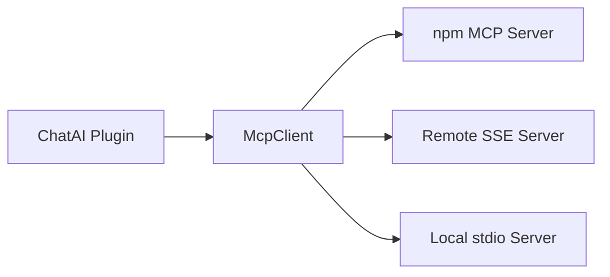

# MCP Server Integration <Badge type="info" text="External" />

Integrate external MCP servers for extended capabilities.

## Overview {#overview}

External MCP servers provide additional tools via the MCP protocol.



## Configuration {#config}

Edit `data/mcp-servers.json`:

```json
{
  "servers": {
    "filesystem": {
      "command": "npx",
      "args": ["-y", "@anthropic/mcp-server-filesystem", "/path/to/dir"]
    },
    "memory": {
      "command": "npx", 
      "args": ["-y", "@anthropic/mcp-server-memory"]
    }
  }
}
```

## Transport Types {#transports}

### stdio (npm packages) {#stdio}

```json
{
  "my-server": {
    "command": "npx",
    "args": ["-y", "@org/mcp-server-name"],
    "env": {
      "API_KEY": "xxx"
    }
  }
}
```

### SSE (Remote Server) {#sse}

```json
{
  "remote-server": {
    "transport": "sse",
    "url": "https://example.com/mcp/sse"
  }
}
```

### HTTP {#http}

```json
{
  "http-server": {
    "transport": "http",
    "url": "https://example.com/mcp"
  }
}
```

## Available MCP Servers {#available}

| Server | Package | Description |
|:-------|:--------|:------------|
| **Filesystem** | `@anthropic/mcp-server-filesystem` | File operations |
| **Memory** | `@anthropic/mcp-server-memory` | Knowledge graph |
| **Fetch** | `@anthropic/mcp-server-fetch` | Web fetching |
| **GitHub** | `@anthropic/mcp-server-github` | GitHub API |
| **Puppeteer** | `@anthropic/mcp-server-puppeteer` | Browser automation |

## Management Commands {#commands}

```txt
#mcp状态          # View MCP server status
#ai重载配置       # Reload configuration
```

## Web Panel {#web-panel}

Manage MCP servers in Web Admin Panel:

1. Go to **MCP** tab
2. View connected servers
3. Enable/disable servers
4. Check tool availability

## Troubleshooting {#troubleshooting}

| Issue | Solution |
|:------|:---------|
| Server not connecting | Check npm package is installed |
| Tools not showing | Verify server is enabled |
| Timeout errors | Increase timeout in config |

::: tip Debug Mode
Enable debug mode to see detailed MCP logs:
```txt
#ai调试开启
```
:::

## Next Steps {#next}

- [Built-in Tools](./builtin) - Core tools
- [Custom JS](./custom-js) - Simple custom tools
- [Security](./security) - Permission settings
