# Tool Security <Badge type="warning" text="Important" />

Security mechanisms and permission control for the tool system.

## Security Layers {#security-layers}

```mermaid
flowchart TB
    subgraph L1["1️⃣ Global Config Filter"]
        A1[Enable/Disable Categories]
        A2[Disable Specific Tools]
    end
    
    subgraph L2["2️⃣ Preset-Level Filter"]
        B1[Whitelist Mode]
        B2[Blacklist Mode]
    end
    
    subgraph L3["3️⃣ Dangerous Tool Control"]
        C1[Dangerous Tool Marking]
        C2[Special Authorization Check]
    end
    
    subgraph L4["4️⃣ User Permission Check"]
        D1[Admin-Only Tools]
        D2[Master-Only Tools]
    end
    
    L1 --> L2 --> L3 --> L4
```



::: tip Layer Description
Tool call requests must pass all security layer checks. Rejection at any layer results in call failure.
:::

## Risk Levels {#risk-levels}

| Level | Icon | Description | Example |
|:------|:----:|:------------|:--------|
| **Safe** | 🟢 | Read-only, no side effects | Get time, query info |
| **Medium** | 🟡 | Limited side effects | Send messages |
| **Higher** | 🟠 | Significant actions | Group admin, file ops |
| **Dangerous** | 🔴 | System access | Shell commands |

## Permission Control {#permissions}

### User Permission Levels

| Level | Description | Allowed Operations |
|:------|:------------|:-------------------|
| `all` | All users | Basic chat, view info |
| `whitelist` | Whitelist users | Specific restricted commands |
| `admin` | Administrators | Group management, tool calls |
| `master` | Bot owner | All operations, system config |

### Whitelist/Blacklist Control


## Dangerous Tools {#dangerous-tools}

### Dangerous Tool Categories


### Dangerous Tool Configuration

```yaml
builtinTools:
  # Allow dangerous tools
  allowDangerous: false
  
  # Dangerous tool list
  dangerousTools:
    - kick_member
    - recall_message
    - set_group_whole_ban
    - execute_command
```

### Temporary Authorization

Some scenarios require temporary dangerous tool access:

```javascript
const agent = await createSkillsAgent({
  event: e,
  allowDangerous: true  // Temporary authorization
})
```

## Global Configuration {#global-config}

### Enable/Disable Categories

```yaml
builtinTools:
  enabledCategories:
    - basic
    - user
    - web
  # Unlisted categories are disabled
```

### Disable Specific Tools

```yaml
builtinTools:
  disabledTools:
    - execute_command
    - delete_file
```

## Preset-Level Control {#preset-control}

### Whitelist Mode

```yaml
# Preset file
tools:
  mode: whitelist
  allowedTools:
    - get_time
    - get_weather
    - search_web
```

### Blacklist Mode

```yaml
tools:
  mode: blacklist
  excludedTools:
    - send_message
    - kick_member
```

## Security Execution Flow {#execution-flow}


## Audit Logging {#audit}

### Log Recording

```yaml
mcp:
  logging:
    enabled: true
    level: info
    retention: 30  # Keep 30 days
```

### Log Content

```json
{
  "id": "uuid",
  "toolName": "send_message",
  "args": {"target": "123", "content": "..."},
  "result": "success",
  "userId": "456",
  "timestamp": "2024-12-15T06:30:00.000Z",
  "duration": 150
}
```

### View Logs

```bash
# Command
#工具日志

# API
GET /api/tools/logs?limit=100&toolName=send_message
```

## Best Practices {#best-practices}

::: tip Security Recommendations
Follow these best practices to ensure secure tool system operation.
:::

| Practice | Description |
|:---------|:------------|
| **Least Privilege** | Only enable needed tools |
| **Use Whitelist Mode** | Use whitelist in presets, explicitly list allowed tools |
| **Disable Dangerous Tools** | Always set `allowDangerous: false` in production |
| **Regular Log Audits** | Regularly check tool call logs for anomalies |
| **Strict Parameter Validation** | Define parameter Schema to prevent injection attacks |

## Security Checklist {#checklist}

::: warning Pre-deployment Check
Ensure completion of the following security checks:
:::

- [ ] Disabled unnecessary tool categories
- [ ] Dangerous tools disabled or controlled
- [ ] Admin tools properly configured
- [ ] Presets using whitelist mode
- [ ] Audit logging enabled
- [ ] Rate limiting configured

## Next Steps {#next}

- [Built-in Tools](./builtin) - Tool reference
- [Custom JS Tools](./custom-js) - Create custom tools
- [MCP Configuration](/en/config/mcp) - MCP settings
