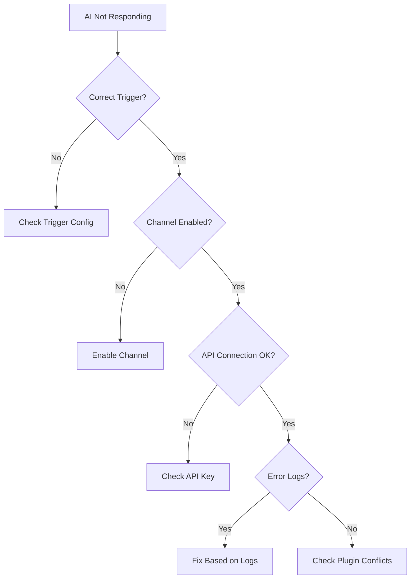

# Troubleshooting <Badge type="warning" text="FAQ" />

This document helps you solve common issues when using ChatAI Plugin.

::: tip Quick Search
Use `Ctrl+F` to search for error keywords, or browse by category.
:::

## Installation Issues {#installation}

### better-sqlite3 Build Failed {#sqlite3-build-fail}

::: danger Error Message
`Could not locate the bindings file` or `node-gyp rebuild failed`
:::

**Solution Steps:**

**Step 1** - Rebuild in Yunzai root directory
```bash
pnpm rebuild better-sqlite3
```

**Step 2** - If still failing, install build tools

::: code-group
```bash [Windows]
# Install Visual Studio Build Tools
# Download: https://visualstudio.microsoft.com/visual-cpp-build-tools/
# Select "Desktop development with C++" during installation
npm install -g windows-build-tools
```

```bash [Linux (Debian/Ubuntu)]
sudo apt update
sudo apt install build-essential python3
```

```bash [Linux (CentOS/RHEL)]
sudo yum groupinstall "Development Tools"
sudo yum install python3
```

```bash [macOS]
xcode-select --install
```
:::

**Step 3** - Clean reinstall
```bash
rm -rf node_modules
pnpm install
pnpm rebuild better-sqlite3
```

::: details Other Possible Solutions
```bash
# Set Python path
npm config set python /usr/bin/python3

# Global install node-gyp
npm install -g node-gyp

# Clear cache and retry
pnpm store prune
```
:::

### Node.js Version Incompatible {#node-version}

::: danger Error Message
Startup errors like `SyntaxError` or abnormal behavior
:::

**Solution:**

```bash
# Check version (requires 18.0+)
node -v

# Switch version using nvm
nvm install 18
nvm use 18

# Or use fnm
fnm install 18
fnm use 18
```

### Dependency Installation Failed {#deps-install-fail}

::: danger Error Message
`pnpm install` errors like `ENOENT`, `EPERM`, etc.
:::

**Solution:**

```bash
# Clear cache
pnpm store prune

# Delete lockfile and reinstall
rm pnpm-lock.yaml
pnpm install
```

::: warning Windows Users Note
If encountering permission issues, try running command line as Administrator
:::

## Startup Issues {#startup}

### Plugin Won't Load {#plugin-load-fail}

::: danger Error Message
No `[ChatAI]` logs in console, or `Cannot find module` error
:::

**Checklist:**

| Check Item | Description | Fix |
|:-----------|:------------|:----|
| Directory name | Must be `plugins/chatgpt-plugin` | Rename directory |
| Entry file | `index.js` must exist | Re-clone plugin |
| Dependencies | Dependencies must be complete | Run `pnpm install` |
| Console logs | Check detailed error messages | Fix based on error |

### Web Panel Inaccessible {#web-panel-fail}

::: danger Error Message
Browser can't open admin panel link, shows connection timeout or refused
:::

**Troubleshooting Steps:**

**1. Check Port Usage**

::: code-group
```bash [Linux/macOS]
netstat -tlnp | grep 3000
lsof -i :3000
```

```powershell [Windows]
netstat -ano | findstr :3000
```
:::

**2. Check Firewall**

::: code-group
```bash [Linux (ufw)]
sudo ufw allow 3000
```

```bash [Linux (firewalld)]
sudo firewall-cmd --add-port=3000/tcp --permanent
sudo firewall-cmd --reload
```

```powershell [Windows]
# Add inbound rule in Windows Firewall
```
:::

**3. Modify Listen Address**

```yaml
# config.yaml
web:
  host: "0.0.0.0"  # Allow external access (default 127.0.0.1 is local only)
  port: 3000       # Change port if occupied
```

### Database Initialization Failed {#db-init-fail}

::: danger Error Message
`SQLITE_CANTOPEN` or `database is locked`
:::

**Solution Steps:**

```bash
# 1. Rebuild better-sqlite3
pnpm rebuild better-sqlite3

# 2. Check directory permissions (Linux/macOS)
chmod 755 plugins/chatgpt-plugin/data

# 3. Delete database file and rebuild (will lose data!)
rm plugins/chatgpt-plugin/data/chatai.db
```

::: warning Data Backup
Backup `data/` directory before deleting database to avoid data loss
:::

## Usage Issues {#usage}

### AI Not Responding {#no-reply}

::: danger Symptom
Bot has no response after sending messages
:::

**Troubleshooting Flowchart:**



**Checklist:**

| Check Item | Action | Description |
|:-----------|:-------|:------------|
| **Trigger Method** | Confirm correct trigger method | @trigger, prefix trigger (e.g., `#chat`) |
| **Channel Config** | Check channel status in Web panel | Click "Test Connection" to verify |
| **Debug Mode** | Send `#ai调试开启` | View detailed error info |
| **Plugin Conflicts** | Check if other plugins intercept | Adjust plugin priority |

### API Authentication Failed (401/403) {#api-auth-fail}

::: danger Error Code
`401 Unauthorized` or `403 Forbidden`
:::

| Possible Cause | Solution |
|:---------------|:---------|
| Wrong API Key | Check if Key is copied completely, no extra spaces |
| Key Expired | Check Key status in provider dashboard |
| Insufficient Balance | Recharge account balance |
| Insufficient Permission | Check Key's API access permissions |
| IP Restriction | Some providers restrict IPs, check if proxy needed |

### API Rate Limited (429) {#api-rate-limit}

::: danger Error Code
`429 Too Many Requests` or `Rate limit exceeded`
:::

**Solutions:**

| Solution | Description | Recommended |
|:---------|:------------|:-----------:|
| Multi-Channel Load Balancing | Configure multiple channels to distribute requests | ⭐⭐⭐ |
| Increase Request Interval | Set `requestInterval` in config | ⭐⭐ |
| Upgrade API Plan | Increase API quota limit | ⭐⭐⭐ |
| Use Backup Channel | Configure failover channel | ⭐⭐⭐ |

### Duplicate Messages {#duplicate-msg}

::: warning Symptom
Same message receives multiple replies
:::

| Check Item | Description |
|:-----------|:------------|
| Duplicate Adapters | Ensure not running multiple Bot adapters simultaneously |
| Message Echo | Check echo config in `config.yaml` |
| Plugin Dedup | Plugin has built-in dedup mechanism |

### Tool Call Failed {#tool-call-fail}

::: danger Symptom
AI tries to call tool but returns error or no response
:::

**Troubleshooting Steps:**

1. **Confirm Tool is Enabled**
   - Web Panel → Tool Management → Check tool status

2. **Check Permission Config**
   - Some tools require master or group admin permission

3. **View Tool Logs**
   ```txt
   #工具日志
   ```

4. **Enable Debug Mode**
   ```txt
   #ai调试开启
   ```

::: details Common Tool Errors
| Error | Cause | Solution |
|:------|:------|:---------|
| `Tool not found` | Tool not enabled or doesn't exist | Enable tool in Web panel |
| `Permission denied` | Insufficient permission | Check user permission config |
| `Timeout` | Tool execution timeout | Check network or tool logic |
:::

## Performance Issues {#performance}

### Slow Response {#slow-response}

::: warning Symptom
High AI response latency, long wait times
:::

| Optimization | Description | Effect |
|:-------------|:------------|:------:|
| Reduce Context | Lower `context.maxMessages` value | ⭐⭐⭐ |
| Use Lighter Model | e.g., `gpt-4o-mini`, `deepseek-chat` | ⭐⭐⭐ |
| Enable Streaming | Set `stream: true` | ⭐⭐ |
| Optimize Network | Configure proxy or use domestic channels | ⭐⭐⭐ |

### High Memory Usage {#high-memory}

::: warning Symptom
Node.js process memory keeps growing
:::

| Optimization | Configuration |
|:-------------|:--------------|
| Reduce context messages | `context.maxMessages: 10` |
| Regularly clear history | Use `#结束对话` command |
| Limit memory count | `memory.maxMemories: 500` |
| Disable unused features | Disable unused tool categories |

## Proxy Issues {#proxy}

### Proxy Connection Failed {#proxy-fail}

::: danger Symptom
API request timeout or connection refused
:::

**Checklist:**

| Check Item | Command/Action |
|:-----------|:---------------|
| Proxy service running | Check if proxy software is started |
| Port correct | Confirm port number (common: 7890, 1080) |
| Proxy type | http/socks5 must match |

**Test Proxy Connectivity:**

```bash
# Test HTTP proxy
curl -x http://127.0.0.1:7890 https://api.openai.com/v1/models

# Test SOCKS5 proxy
curl -x socks5://127.0.0.1:1080 https://api.openai.com/v1/models
```

### Some Requests Bypass Proxy {#proxy-bypass}

```yaml
# config.yaml
proxy:
  enabled: true
  type: http        # http or socks5
  host: 127.0.0.1
  port: 7890
  noProxy: []       # Ensure target domains not excluded
```

## MCP Issues {#mcp}

### MCP Server Connection Failed {#mcp-connect-fail}

::: danger Symptom
MCP tools unavailable, status shows offline
:::

**Troubleshooting Steps:**

1. **Check MCP Status**
   ```txt
   #mcp状态
   ```

2. **Check npm Package Installation**
   ```bash
   # Confirm MCP server package is installed
   npm list -g @anthropic/mcp-server-xxx
   ```

3. **Check Configuration File**
   ```json
   // data/mcp-servers.json
   {
     "servers": {
       "my-server": {
         "command": "npx",
         "args": ["-y", "@xxx/mcp-server"]
       }
     }
   }
   ```

### Tool Unavailable {#tool-unavailable}

| Check Item | Description |
|:-----------|:------------|
| Server Connection | Confirm MCP server status is online |
| Tool List | Check if tool is in `tools/list` response |
| Permission Config | Check preset tool whitelist/blacklist |

## Logging {#logging}

### Enable Debug Mode {#debug-mode}

```txt
#ai调试开启
```

::: tip Debug Mode Features
- Shows detailed API request/response logs
- Shows tool call details
- Shows error stack traces
:::

### View Logs {#view-logs}

::: code-group
```bash [Yunzai Logs]
# Real-time log viewing
tail -f logs/latest.log

# Search error logs
grep -i "error\|fail" logs/latest.log
```

```txt [Tool Logs]
#工具日志
```

```txt [MCP Status]
#mcp状态
```
:::

### Submit Issue {#submit-issue}

::: info When Submitting Issues, Please Include
1. **Error Screenshot** - Complete error stack trace
2. **Related Config** - Config with API Key hidden
3. **Reproduction Steps** - Detailed operation steps
4. **Environment Info** - Node.js version, OS, Yunzai version
:::

## Common Error Codes {#error-codes}

| Code | Description | Solution |
|:----:|:------------|:---------|
| `401` | Authentication Failed | Check if API Key is correct |
| `403` | Permission Denied | Check Key permission scope |
| `429` | Too Many Requests | Lower frequency or switch channels |
| `500` | Server Error | Retry later |
| `502` | Gateway Error | Check proxy or retry later |
| `503` | Service Unavailable | Wait for service recovery |
| `ECONNREFUSED` | Connection Refused | Check network and proxy config |
| `ETIMEDOUT` | Connection Timeout | Check network or increase timeout |

## Get Help {#get-help}

::: tip 🆘 Get Support
:::

| Channel | Link | Use Case |
|:--------|:-----|:---------|
| **GitHub Issues** | [Submit Issue](https://github.com/XxxXTeam/chatai-pluginissues) | Bug reports, feature requests |
| **Documentation** | [View Docs](/) | Configuration and usage questions |
| **QQ Group** | See project README | Discussion and chat |
