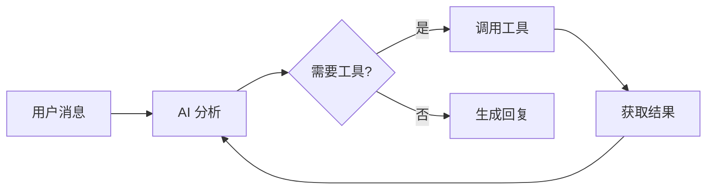

# Agent 模式指南 <Badge type="tip" text="核心功能" />

Agent 模式让 AI 能够自主调用工具完成复杂任务，是插件的核心特性之一。

::: info 🤖 什么是 Agent？
Agent（智能体）是指 AI 不仅能回答问题，还能**主动调用工具、执行操作、获取信息**，像一个智能助手一样为你完成任务。
:::

## 什么是 Agent 模式 {#what-is-agent}

在 Agent 模式下，AI 不仅可以回复消息，还能：

- **调用工具**：执行搜索、发消息、操作群组等
- **多步推理**：分解复杂任务，逐步完成
- **获取信息**：主动查询时间、天气、用户信息等
- **记忆学习**：记住用户偏好，个性化回复



## 快速启用 {#quick-enable}

::: code-group
```txt [方式一：Web 面板]
1. 打开管理面板
2. 进入「配置 → MCP/工具」
3. 开启「启用内置工具」
4. 选择需要的工具类别
```

```yaml [方式二：配置文件]
builtinTools:
  enabled: true
  enabledCategories:
    - basic      # 基础工具
    - user       # 用户工具
    - web        # 网络工具
    - group      # 群组工具
```
:::

## 工具类别（22个）{#tool-categories}

| 类别 | 图标 | 说明 | 示例工具 |
|:-----|:----:|:-----|:---------|
| **basic** | 🔧 | 基础功能 | `get_time`, `calculate` |
| **user** | 👤 | 用户信息 | `get_user_info`, `get_user_avatar` |
| **group** | 👥 | 群组信息 | `get_group_info`, `get_member_list` |
| **message** | � | 消息操作 | `send_message`, `get_chat_history` |
| **admin** | 🛡️ | 群管理 | `mute_member`, `kick_member` |
| **groupStats** | 📊 | 群统计 | 发言榜、龙王、不活跃成员 |
| **file** | 📁 | 文件操作 | 群文件上传下载、本地文件读写 |
| **media** | 🎨 | 媒体处理 | 图片解析、OCR、二维码生成 |
| **web** | 🌐 | 网页访问 | `fetch_url`, `web_search` |
| **search** | � | 搜索工具 | 网页搜索、Wiki查询、翻译 |
| **utils** | 🔨 | 实用工具 | 计算、编码转换、哈希 |
| **memory** | 🧠 | 记忆管理 | `save_memory`, `search_memory` |
| **context** | 📜 | 上下文管理 | 对话上下文、群聊上下文 |
| **bot** | 🤖 | Bot信息 | 获取机器人状态、好友列表 |
| **voice** | 🎙️ | 语音/声聊 | TTS语音合成、语音识别 |
| **extra** | ✨ | 扩展工具 | 天气查询、一言、骰子、插画 |
| **shell** | 💻 | 系统命令 | 执行Shell命令（⚠️危险） |
| **schedule** | ⏰ | 定时任务 | 自然语言定时任务 |
| **bltools** | 🎵 | 扩展工具集 | QQ音乐、表情包、B站视频、GitHub |
| **reminder** | 🔔 | 定时提醒 | 相对/绝对时间提醒、重复提醒 |
| **imageGen** | 🎨 | 绘图服务 | 文生图、图生图、文生视频 |
| **qzone** | ⭐ | QQ空间 | 发说说、点赞、个性签名 |

## 使用示例

### 基础查询

```
用户: 现在几点了？

AI: [调用 get_time 工具]
    现在是 2024年12月15日 下午3:30。
```

### 信息搜索

```
用户: 帮我搜索一下最新的 AI 新闻

AI: [调用 web_search 工具]
    找到以下最新 AI 新闻：
    1. OpenAI 发布 GPT-5...
    2. Google 推出新版 Gemini...
```

### 复杂任务

```
用户: 明天下午3点提醒我开会

AI: [调用 set_reminder 工具]
    好的，我已设置明天下午3点的提醒：开会。
    届时会私聊通知你。
```

### 群组操作

```
用户: 这个群有多少人？

AI: [调用 get_group_info 工具]
    这个群目前有 128 位成员，其中：
    - 群主 1 人
    - 管理员 5 人
    - 普通成员 122 人
```

## 预设配置

在预设中可以精细控制 Agent 行为：

```yaml
# 预设文件
name: 我的助手

tools:
  enabled: true
  # 只允许特定工具
  allowedTools:
    - get_time
    - get_weather
    - web_search
  # 排除危险工具
  excludedTools:
    - execute_command
  # 是否允许危险操作
  allowDangerous: false
```

## 权限控制

### 用户权限

不同权限用户可使用的工具不同：

| 权限级别 | 可用工具 |
|:---------|:---------|
| 普通用户 | 基础工具、用户工具 |
| 群管理员 | + 群组工具 |
| 主人 | 全部工具 |

### 危险工具

部分工具被标记为「危险」，需要特殊权限：

```yaml
builtinTools:
  allowDangerous: false  # 默认禁用危险工具
```

危险工具包括：
- `execute_command` - 执行系统命令
- `write_file` - 写入文件
- `modify_config` - 修改配置

## 调试模式

开启调试模式查看工具调用详情：

```bash
#ai调试开启
```

调试信息会显示：
- 调用的工具名称
- 传入的参数
- 返回的结果
- 执行耗时

```
[调试] 工具调用: get_weather
[调试] 参数: {"city": "北京"}
[调试] 结果: {"temp": 15, "condition": "晴"}
[调试] 耗时: 1.2s
```

## ChatAgent API

开发者可以通过 ChatAgent 类使用 Agent 功能：

```javascript
import { createChatAgent } from './src/services/agent/ChatAgent.js'

// 创建 Agent
const agent = await createChatAgent({
  event: e,           // 消息事件
  enableSkills: true, // 启用技能
  presetId: 'default' // 使用的预设
})

// 发送消息并获取回复
const result = await agent.chat('帮我查一下北京天气')

console.log(result.text)      // AI 回复文本
console.log(result.toolCalls) // 工具调用记录
```

### SkillsAgent

直接调用工具：

```javascript
import { SkillsAgent } from './src/services/agent/SkillsAgent.js'

const agent = new SkillsAgent({
  userId: '123456',
  groupId: '789'
})
await agent.init()

// 执行单个工具
const weather = await agent.execute('get_weather', { city: '北京' })

// 并行执行多个工具
const results = await agent.executeParallel([
  { name: 'get_time', args: {} },
  { name: 'get_weather', args: { city: '北京' } }
])
```

## 最佳实践

### 1. 合理选择工具

```yaml
# ✅ 按需启用
builtinTools:
  enabledCategories:
    - basic
    - user

# ❌ 全部启用可能导致混乱
builtinTools:
  enabledCategories:
    - all
```

### 2. 预设隔离

不同场景使用不同预设：

```yaml
# 客服预设 - 只允许查询工具
name: 客服助手
tools:
  allowedTools:
    - get_time
    - web_search
    - get_user_info

# 管理预设 - 允许操作工具
name: 管理助手
tools:
  allowedTools:
    - get_group_info
    - set_group_title
    - kick_member
```

### 3. 监控日志

定期查看工具调用日志：

```bash
#工具日志
```

或在 Web 面板查看统计数据。

## 常见问题

### Q: AI 不调用工具？

1. 检查工具是否启用：`builtinTools.enabled: true`
2. 检查工具类别是否包含所需工具
3. 检查预设是否限制了工具

### Q: 工具调用失败？

1. 查看调试日志了解错误原因
2. 检查工具所需的权限
3. 检查网络连接（网络工具）

### Q: 工具调用太慢？

1. 减少启用的工具数量
2. 使用更快的模型
3. 优化网络工具的超时设置

## 下一步

- [工具开发](/tools/) - 开发自定义工具
- [MCP 配置](/config/mcp) - 接入外部 MCP
- [预设管理](/guide/presets) - 配置预设工具
