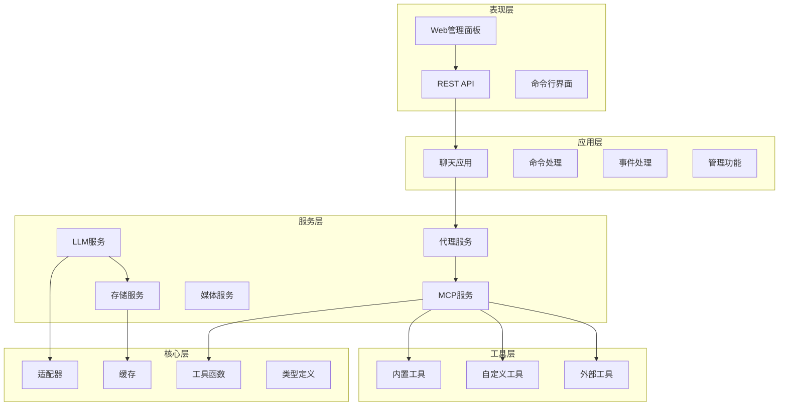
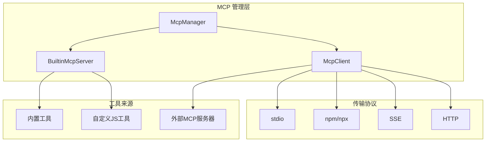
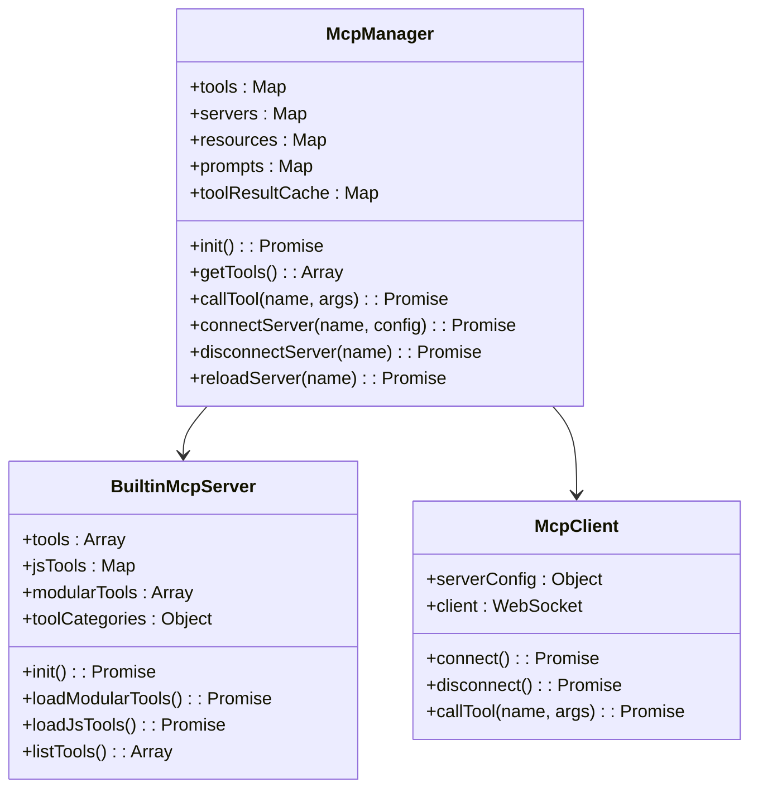
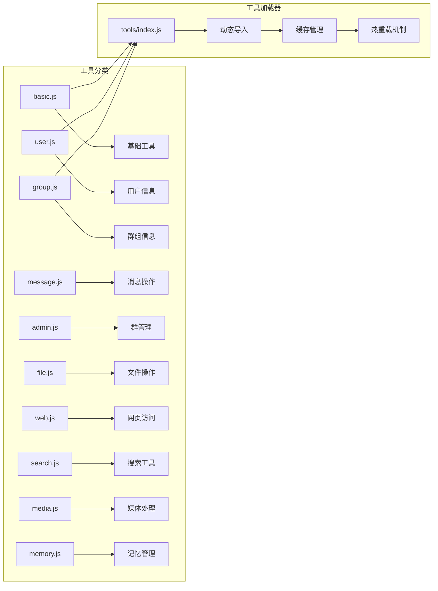
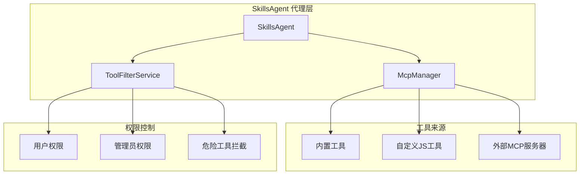
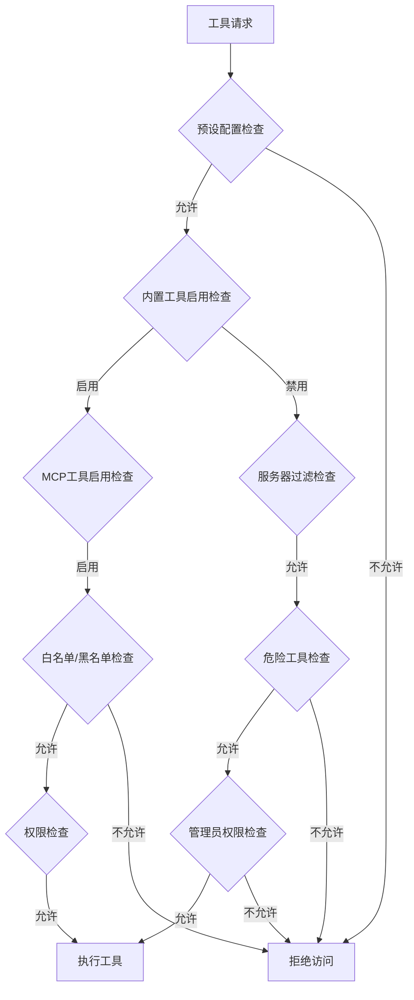
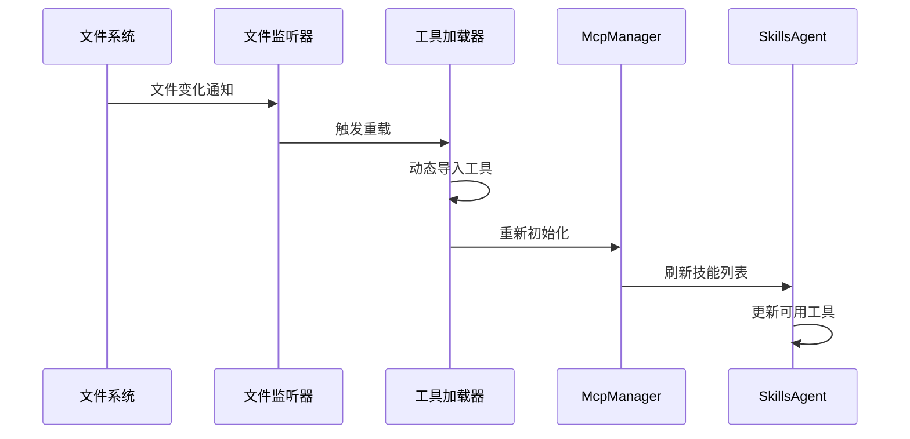

# 开发者指南 <Badge type="tip" text="进阶" />

本指南面向开发者，详细介绍 ChatAI Plugin 的架构设计、核心组件和开发最佳实践。

## 项目架构 {#architecture}

项目采用分层架构设计，确保各层职责明确，便于维护和扩展。



### 目录结构 {#directory}

| 目录 | 说明 |
|:-----|:-----|
| `apps/` | 应用模块层，处理具体的业务功能 |
| `src/core/` | 核心模块层，提供基础工具和适配器 |
| `src/mcp/` | MCP 协议处理层，实现工具调用和管理 |
| `src/services/` | 服务层，提供各种业务服务 |
| `config/` | 配置管理 |
| `data/` | 运行时数据存储 |
| `frontend/` | Next.js 前端管理面板 |
| `docs/` | 项目文档 |

## MCP 系统架构 {#mcp-architecture}

MCP (Model Context Protocol) 系统提供强大的工具调用能力，支持内置工具、自定义 JS 工具和外部 MCP 服务器。



### McpManager 核心功能 {#mcp-manager}



### 工具分类系统 {#tool-categories}



## Skills Agent 代理层 {#skills-agent}

SkillsAgent 提供统一的技能代理接口，整合内置工具、自定义工具和外部 MCP 服务器。



### 工具过滤机制 {#tool-filter}



## 工具开发指南 {#tool-development}

### 工具开发最佳实践 {#best-practices}

#### 1. 良好的工具描述

```javascript
// ✅ 好的描述 - 清晰说明功能和使用场景
description: '查询指定城市的实时天气信息，包括温度、湿度、风力等'

// ❌ 差的描述 - 模糊不清
description: '获取天气'
```

#### 2. 参数验证和错误处理

```javascript
async run(args, context) {
    const { city } = args
    
    // 验证必要参数
    if (!city || typeof city !== 'string') {
        return { error: '请提供有效的城市名称' }
    }
    
    // 验证参数范围
    if (city.length > 50) {
        return { error: '城市名称过长' }
    }
    
    // 处理业务逻辑
    try {
        const response = await fetch(apiUrl)
        if (!response.ok) {
            return { error: `API请求失败: HTTP ${response.status}` }
        }
        
        const data = await response.json()
        return { success: true, data }
    } catch (error) {
        logger.error('[WeatherTool] 执行失败:', error)
        return { error: `操作失败: ${error.message}` }
    }
}
```

#### 3. 超时控制和资源管理

```javascript
async run(args, context) {
    try {
        const controller = new AbortController()
        const timeout = setTimeout(() => controller.abort(), 10000)
        
        const response = await fetch(url, {
            signal: controller.signal
        })
        
        clearTimeout(timeout)
        return { success: true, data: await response.json() }
        
    } catch (error) {
        if (error.name === 'AbortError') {
            return { error: '请求超时' }
        }
        return { error: error.message }
    }
}
```

### 基础工具模板 {#tool-template}

```javascript
// data/tools/weather.js
export default {
    name: 'get_weather',
    
    function: {
        name: 'get_weather',
        description: '查询指定城市的天气信息',
        parameters: {
            type: 'object',
            properties: {
                city: {
                    type: 'string',
                    description: '城市名称'
                }
            },
            required: ['city']
        }
    },

    async run(args, context) {
        const { city } = args
        
        try {
            const url = `https://wttr.in/${encodeURIComponent(city)}?format=j1`
            const response = await fetch(url)
            const data = await response.json()
            
            const current = data.current_condition[0]
            
            return {
                success: true,
                city,
                temperature: `${current.temp_C}°C`,
                weather: current.weatherDesc[0].value,
                humidity: `${current.humidity}%`
            }
        } catch (error) {
            return { error: `获取天气失败: ${error.message}` }
        }
    }
}
```

### 群管理工具模板 {#admin-tool-template}

```javascript
// data/tools/group_manage.js
export default {
    name: 'group_welcome',
    
    function: {
        name: 'group_welcome',
        description: '设置群欢迎语',
        parameters: {
            type: 'object',
            properties: {
                message: {
                    type: 'string',
                    description: '欢迎语内容，支持{at}表示@新成员'
                }
            },
            required: ['message']
        }
    },

    async run(args, context) {
        const e = context.getEvent()
        
        if (!e.group_id) {
            return { error: '此工具只能在群聊中使用' }
        }
        
        // 检查权限
        if (!e.member?.is_admin && !e.member?.is_owner) {
            return { error: '需要管理员权限' }
        }
        
        return {
            success: true,
            message: `已设置群欢迎语: ${args.message}`
        }
    }
}
```

### 工具热重载机制 {#hot-reload}



## 开发环境配置 {#dev-environment}

### 环境要求 {#requirements}

| 依赖 | 版本 | 说明 |
|:-----|:-----|:-----|
| Node.js | >= 18 | 运行时环境 |
| pnpm | >= 8.0 | 包管理器 |
| Redis | 可选 | 缓存和会话存储 |
| 编译工具 | 可选 | 原生模块编译 |

### 本地开发步骤 {#local-dev}

```bash
# 克隆仓库
git clone https://github.com/XxxXTeam/chatai-plugin.git
cd chatai-plugin

# 安装依赖
pnpm install

# 构建原生模块
pnpm rebuild better-sqlite3

# 开发模式启动前端
cd frontend && pnpm dev
```

### VSCode 调试配置 {#vscode-debug}

在 `.vscode/launch.json` 中添加：

```json
{
    "version": "0.2.0",
    "configurations": [
        {
            "type": "node",
            "request": "attach",
            "name": "Attach to Yunzai",
            "port": 9229,
            "restart": true
        }
    ]
}
```

启动 Yunzai 时启用调试：

```bash
node --inspect app
```

## 代码规范 {#code-style}

### 命名规范 {#naming}

| 类型 | 规范 | 示例 |
|:-----|:-----|:-----|
| 文件名 | camelCase 或 PascalCase | `ChatService.js`, `helpers.js` |
| 类名 | PascalCase | `ChatService`, `ContextManager` |
| 函数名 | camelCase | `getUserInfo`, `parseMessage` |
| 常量 | UPPER_SNAKE_CASE | `MAX_TOKENS`, `DEFAULT_MODEL` |
| 变量 | camelCase | `userId`, `groupId` |

### 错误处理 {#error-handling}

```javascript
// ✅ 统一的错误处理
async function processRequest() {
    try {
        const result = await doSomething()
        return { success: true, data: result }
    } catch (error) {
        logger.error('[Module] 处理失败:', error)
        return { success: false, error: error.message }
    }
}
```

### 日志规范 {#logging}

```javascript
// 日志级别使用
logger.debug('[Module] 调试信息')    // 调试信息
logger.info('[Module] 一般信息')     // 重要信息
logger.warn('[Module] 警告信息')     // 警告
logger.error('[Module] 错误信息')    // 错误

// 格式：[模块名] 消息内容
logger.info('[ChatService] 收到消息:', userId)
```

### 提交规范 {#commit}

遵循 [Conventional Commits](https://www.conventionalcommits.org/)：

```bash
# 新功能
git commit -m "feat(mcp): 添加天气查询工具"

# Bug修复
git commit -m "fix(adapter): 修复流式响应中断问题"

# 文档更新
git commit -m "docs: 更新开发文档"

# 重构
git commit -m "refactor(core): 重构消息处理流程"
```

## 性能优化 {#performance}

### 缓存策略 {#caching}

| 缓存类型 | 用途 |
|:---------|:-----|
| **Redis 缓存** | 会话状态、配置数据 |
| **内存缓存** | 频繁访问的工具定义 |
| **数据库缓存** | SQLite 本地缓存 |
| **工具结果缓存** | 工具执行结果缓存 |

### 并发处理 {#concurrency}

- **Promise 并行执行**：插件初始化时并行启动各个组件
- **流式响应**：支持 LLM 流式响应，提升用户体验
- **工具并行执行**：支持多个工具并行调用

## 下一步 {#next}

- [工具开发](/tools/) - 工具系统详解
- [架构概述](/architecture/) - 深入了解系统架构
- [MCP 配置](/config/mcp) - MCP 服务器配置
