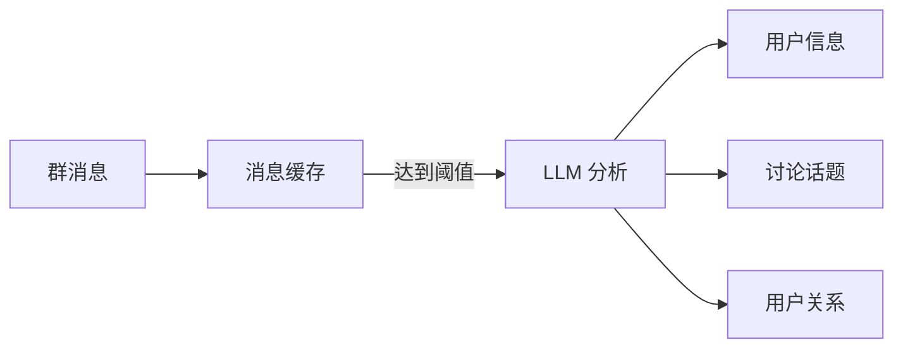

# 记忆系统指南 <Badge type="tip" text="个性化" />

长期记忆让 AI 记住用户偏好和历史信息，提供更个性化的对话体验。

::: info 🧠 记忆系统
记忆系统会自动从对话中提取用户信息，在后续对话中使用，让 AI 更懂你。
:::

## 快速开始 {#quick-start}

### 启用记忆

1. 在 Web 面板中，进入 **配置 → 记忆**
2. 开启 **启用长期记忆**
3. 保存配置

或在配置文件中：

```yaml
memory:
  enabled: true
```

### 基础使用

记忆启用后，AI 会自动：

- **提取信息**：从对话中识别用户的姓名、偏好、重要日期等
- **存储记忆**：将提取的信息分类保存
- **个性化回复**：在后续对话中使用记忆信息

::: tip 示例对话
**用户**：我叫小明，今天是我的生日

**AI**：生日快乐，小明！🎂 希望你今天过得愉快！

*（下次对话时）*

**用户**：你还记得我吗？

**AI**：当然记得，小明！对了，你的生日快到了吗？
:::

## 记忆分类 {#categories}

系统将记忆分为六大类：

| 类别 | 图标 | 说明 | 示例 |
|:-----|:----:|:-----|:-----|
| **基本信息** | 👤 | 姓名、年龄、职业等 | "用户叫小明，25岁，程序员" |
| **偏好习惯** | ❤️ | 喜好、讨厌、习惯 | "喜欢打游戏，讨厌吃香菜" |
| **重要事件** | 📅 | 生日、纪念日、计划 | "生日是3月15日" |
| **人际关系** | 👥 | 家人、朋友、同事 | "小红是用户的好朋友" |
| **话题兴趣** | 💬 | 感兴趣的话题 | "对 AI 技术感兴趣" |
| **自定义** | 🏷️ | 其他信息 | 任意自定义内容 |

## 管理记忆 {#manage}

### 命令方式 {#commands}

::: code-group
```bash [查看记忆]
#ai查看记忆
```

```bash [清除记忆]
#ai清除记忆
```

```bash [添加记忆（主人）]
#ai添加记忆 @用户 喜欢吃披萨
```
:::

### Web 面板

1. 进入群组管理页面
2. 选择目标群组
3. 点击 **记忆管理** 标签

在此可以：
- 查看用户记忆列表
- 按分类筛选记忆
- 编辑或删除单条记忆
- 批量清理记忆

## 群聊上下文

群聊上下文功能自动收集和分析群聊信息：

```yaml
memory:
  groupContext:
    enabled: true
    collectInterval: 10       # 每10分钟收集一次
    analyzeThreshold: 20      # 20条消息后触发分析
    extractUserInfo: true     # 提取用户信息
    extractTopics: true       # 提取讨论话题
    extractRelations: true    # 提取用户关系
```

### 工作原理



### 提取内容

- **用户信息**：昵称偏好、说话风格、活跃时段
- **讨论话题**：群内热门话题、用户兴趣
- **用户关系**：谁和谁是好友、谁经常互动

## 摘要推送

定时推送群聊摘要，帮助群成员了解错过的内容：

```yaml
memory:
  summaryPush:
    enabled: true
    defaultPushHour: 22       # 每天22点推送
    maxMessages: 300          # 最多分析300条消息
    useLLM: true              # 使用 AI 生成摘要
```

### 效果示例

```
📊 群聊今日摘要

📌 主要话题
• 讨论了新版本发布计划
• 分享了周末活动照片
• 技术问题讨论：Python 异步编程

👥 活跃成员
小明(50条)、小红(35条)、小华(28条)

💬 精彩发言
"这个方案比之前的效率提升了3倍" - 小明
```

## 记忆模型

可以指定专门用于记忆提取的模型：

```yaml
memory:
  model: "gpt-4o-mini"  # 使用较便宜的模型处理记忆
```

::: tip 建议
记忆提取不需要最强的模型，使用 `gpt-4o-mini` 或 `claude-3-haiku` 即可，可以节省成本。
:::

## 隐私与安全

### 记忆范围

- **个人记忆**：仅用户本人的对话会被记忆
- **群聊记忆**：群聊信息仅在该群使用
- **数据隔离**：不同群/用户的记忆完全隔离

### 用户控制

用户可以随时：
- 查看自己的记忆
- 删除特定记忆
- 清除全部记忆

### 敏感信息

系统不会提取和存储：
- 密码、API Key 等敏感信息
- 银行卡号、身份证号
- 私密聊天内容

## 配置参考

### 完整配置

```yaml
memory:
  # 基础设置
  enabled: true
  storage: database
  maxMemories: 50
  
  # 自动提取
  autoExtract: true
  pollInterval: 5
  model: ""
  
  # 群聊上下文
  groupContext:
    enabled: true
    collectInterval: 10
    maxMessagesPerCollect: 50
    analyzeThreshold: 20
    extractUserInfo: true
    extractTopics: true
    extractRelations: true
  
  # 摘要推送
  summaryPush:
    enabled: false
    checkInterval: 58
    defaultInterval: 1
    defaultPushHour: 22
    maxMessages: 300
    useLLM: true
    groups: {}
    intervalType: hour
  
  # 摘要模型
  summaryModel: ""
```

### 参数说明

| 参数 | 类型 | 默认值 | 说明 |
|:-----|:-----|:-------|:-----|
| `enabled` | boolean | `false` | 启用记忆系统 |
| `storage` | string | `database` | 存储方式 |
| `maxMemories` | number | `50` | 每用户最大记忆数 |
| `autoExtract` | boolean | `true` | 自动提取记忆 |
| `pollInterval` | number | `5` | 提取间隔（分钟） |
| `model` | string | `""` | 提取模型（空=默认） |

## 最佳实践

### 1. 合理设置记忆数量

```yaml
memory:
  maxMemories: 30  # 太多会影响对话质量
```

### 2. 使用经济模型

```yaml
memory:
  model: "gpt-4o-mini"
  summaryModel: "gpt-4o-mini"
```

### 3. 针对性开启功能

```yaml
memory:
  groupContext:
    extractUserInfo: true   # 开启
    extractTopics: false    # 不需要的关闭
    extractRelations: false
```

## 故障排除

### 记忆未生效

1. 检查是否启用：`memory.enabled: true`
2. 检查是否有可用的 API 渠道
3. 查看日志是否有错误

### 记忆提取不准确

1. 尝试更换提取模型
2. 检查对话内容是否足够清晰
3. 手动添加重要记忆

### 记忆过多

```bash
# 清理旧记忆
#ai清除记忆
```

## 下一步

- [记忆配置](/config/memory) - 详细配置选项
- [记忆架构](/architecture/memory) - 技术实现
- [触发配置](/guide/triggers) - 配置触发方式
