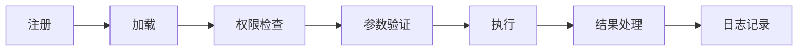

# 高级工具开发 <Badge type="warning" text="进阶" />

本文档介绍工具开发的高级技巧和最佳实践。

::: tip 📖 前置阅读
建议先阅读 [自定义 JS 工具](./custom-js) 了解基础用法，再阅读本文档。
:::

## 工具生命周期 {#lifecycle}



### 初始化钩子

```javascript
export default {
  name: 'my_tool',
  description: '我的工具',
  
  // 工具加载时调用
  async onLoad() {
    console.log('[my_tool] 工具已加载')
    // 初始化资源、连接等
  },
  
  // 工具卸载时调用
  async onUnload() {
    console.log('[my_tool] 工具已卸载')
    // 清理资源
  },
  
  inputSchema: { type: 'object', properties: {} },
  handler: async (args) => ({ result: 'ok' })
}
```

## 高级参数验证

### 自定义验证器

```javascript
export default {
  name: 'advanced_tool',
  description: '高级参数验证示例',
  
  inputSchema: {
    type: 'object',
    properties: {
      email: {
        type: 'string',
        description: '邮箱地址',
        pattern: '^[^@]+@[^@]+\\.[^@]+$'
      },
      age: {
        type: 'integer',
        minimum: 0,
        maximum: 150
      },
      tags: {
        type: 'array',
        items: { type: 'string' },
        minItems: 1,
        maxItems: 10
      }
    },
    required: ['email']
  },
  
  // 额外验证逻辑
  validate(args) {
    if (args.email && args.email.includes('spam')) {
      throw new Error('不允许的邮箱域名')
    }
    return true
  },
  
  handler: async (args) => {
    return { success: true }
  }
}
```

### 条件必填

```javascript
inputSchema: {
  type: 'object',
  properties: {
    type: { type: 'string', enum: ['file', 'url'] },
    filePath: { type: 'string' },
    url: { type: 'string' }
  },
  required: ['type'],
  // 根据 type 决定其他必填字段
  if: { properties: { type: { const: 'file' } } },
  then: { required: ['type', 'filePath'] },
  else: { required: ['type', 'url'] }
}
```

## 上下文访问

### 完整上下文 API

```javascript
import { getBuiltinToolContext } from '../../src/mcp/BuiltinMcpServer.js'

export default {
  name: 'context_demo',
  description: '上下文访问示例',
  
  inputSchema: { type: 'object', properties: {} },
  
  handler: async (args) => {
    const ctx = getBuiltinToolContext()
    
    // 事件信息
    const event = ctx.getEvent()
    const userId = event?.user_id
    const groupId = event?.group_id
    const messageId = event?.message_id
    
    // 权限信息
    const isMaster = ctx.isMaster
    const isAdmin = ctx.isAdmin
    const isGroupOwner = ctx.isGroupOwner
    
    // Bot 实例
    const bot = ctx.getBot()
    
    // 当前配置
    const config = ctx.getConfig()
    
    // 预设信息
    const preset = ctx.getPreset()
    
    return {
      userId,
      groupId,
      isMaster,
      isAdmin
    }
  }
}
```

### 发送消息

```javascript
handler: async (args) => {
  const ctx = getBuiltinToolContext()
  const bot = ctx.getBot()
  const event = ctx.getEvent()
  
  // 回复当前消息
  await event.reply('处理完成')
  
  // 发送到指定群
  await bot.pickGroup('123456').sendMsg('群消息')
  
  // 发送私聊
  await bot.pickUser('789').sendMsg('私聊消息')
  
  // 发送图片
  await event.reply(segment.image('/path/to/image.png'))
  
  // 发送合并转发
  const msgs = [
    { message: '消息1' },
    { message: '消息2' }
  ]
  await event.reply(await bot.makeForwardMsg(msgs))
  
  return { success: true }
}
```

## 异步与流式

### 长时间任务

```javascript
export default {
  name: 'long_task',
  description: '长时间运行的任务',
  
  // 标记为长时间任务
  longRunning: true,
  
  inputSchema: { type: 'object', properties: {} },
  
  handler: async (args) => {
    const ctx = getBuiltinToolContext()
    
    // 发送进度通知
    await ctx.getEvent()?.reply('任务开始，请稍候...')
    
    // 执行耗时操作
    const result = await heavyComputation()
    
    // 完成通知
    await ctx.getEvent()?.reply('任务完成！')
    
    return { result }
  }
}
```

### 超时控制

```javascript
export default {
  name: 'timeout_demo',
  description: '超时控制示例',
  
  // 设置超时（毫秒）
  timeout: 30000,
  
  inputSchema: { type: 'object', properties: {} },
  
  handler: async (args) => {
    const controller = new AbortController()
    const timeoutId = setTimeout(() => controller.abort(), 25000)
    
    try {
      const result = await fetch('https://api.example.com/slow', {
        signal: controller.signal
      })
      return await result.json()
    } finally {
      clearTimeout(timeoutId)
    }
  }
}
```

## 权限控制

### 权限标记

```javascript
export default {
  name: 'admin_tool',
  description: '仅管理员可用',
  
  // 权限标记
  adminOnly: true,        // 仅管理员
  masterOnly: false,      // 仅主人
  dangerous: false,       // 危险操作
  groupOnly: true,        // 仅群聊
  privateOnly: false,     // 仅私聊
  
  inputSchema: { type: 'object', properties: {} },
  handler: async (args) => ({ result: 'ok' })
}
```

### 自定义权限检查

```javascript
export default {
  name: 'custom_permission',
  description: '自定义权限检查',
  
  // 自定义权限检查函数
  checkPermission(ctx) {
    const event = ctx.getEvent()
    
    // 检查是否在白名单群
    const allowedGroups = ['123456', '789012']
    if (!allowedGroups.includes(event?.group_id)) {
      return { allowed: false, reason: '该群未授权使用此工具' }
    }
    
    // 检查用户等级
    const userLevel = getUserLevel(event?.user_id)
    if (userLevel < 5) {
      return { allowed: false, reason: '需要5级以上用户' }
    }
    
    return { allowed: true }
  },
  
  inputSchema: { type: 'object', properties: {} },
  handler: async (args) => ({ result: 'ok' })
}
```

## 错误处理

### 错误类型

```javascript
// 定义自定义错误
class ToolError extends Error {
  constructor(message, code, recoverable = false) {
    super(message)
    this.code = code
    this.recoverable = recoverable
  }
}

export default {
  name: 'error_handling',
  description: '错误处理示例',
  
  inputSchema: {
    type: 'object',
    properties: {
      action: { type: 'string' }
    }
  },
  
  handler: async (args) => {
    try {
      const result = await performAction(args.action)
      return { success: true, result }
    } catch (error) {
      // 可恢复错误：返回错误信息让 AI 重试
      if (error.recoverable) {
        return {
          error: true,
          message: error.message,
          suggestion: '请尝试其他参数'
        }
      }
      
      // 不可恢复错误：抛出
      throw error
    }
  }
}
```

### 重试机制

```javascript
async function withRetry(fn, maxRetries = 3, delay = 1000) {
  for (let i = 0; i < maxRetries; i++) {
    try {
      return await fn()
    } catch (error) {
      if (i === maxRetries - 1) throw error
      await new Promise(r => setTimeout(r, delay * (i + 1)))
    }
  }
}

export default {
  name: 'retry_demo',
  
  handler: async (args) => {
    return await withRetry(async () => {
      const response = await fetch('https://api.example.com/data')
      if (!response.ok) throw new Error('API 请求失败')
      return response.json()
    })
  }
}
```

## 工具组合

### 调用其他工具

```javascript
import { SkillsAgent } from '../../src/services/agent/SkillsAgent.js'

export default {
  name: 'composite_tool',
  description: '组合多个工具',
  
  inputSchema: {
    type: 'object',
    properties: {
      city: { type: 'string' }
    }
  },
  
  handler: async (args) => {
    const ctx = getBuiltinToolContext()
    const agent = await createSkillsAgent({ event: ctx.getEvent() })
    
    // 并行调用多个工具
    const [weather, time] = await Promise.all([
      agent.execute('get_weather', { city: args.city }),
      agent.execute('get_time', { timezone: 'Asia/Shanghai' })
    ])
    
    return {
      city: args.city,
      weather: weather.text,
      time: time.text
    }
  }
}
```

## 状态管理

### 持久化状态

```javascript
import { databaseService } from '../../src/services/storage/DatabaseService.js'

export default {
  name: 'stateful_tool',
  description: '带状态的工具',
  
  inputSchema: {
    type: 'object',
    properties: {
      action: { type: 'string', enum: ['get', 'set', 'increment'] },
      key: { type: 'string' },
      value: { type: 'string' }
    }
  },
  
  handler: async (args) => {
    const db = databaseService.db
    const { action, key, value } = args
    
    switch (action) {
      case 'get':
        const row = db.prepare('SELECT value FROM tool_state WHERE key = ?').get(key)
        return { value: row?.value }
        
      case 'set':
        db.prepare('INSERT OR REPLACE INTO tool_state (key, value) VALUES (?, ?)')
          .run(key, value)
        return { success: true }
        
      case 'increment':
        db.prepare(`
          INSERT INTO tool_state (key, value) VALUES (?, 1)
          ON CONFLICT(key) DO UPDATE SET value = value + 1
        `).run(key)
        const result = db.prepare('SELECT value FROM tool_state WHERE key = ?').get(key)
        return { value: result.value }
    }
  }
}
```

## 测试工具

### 单元测试

```javascript
// tests/my_tool.test.js
import { describe, it, expect } from 'vitest'
import myTool from '../data/tools/my_tool.js'

describe('my_tool', () => {
  it('should return correct result', async () => {
    const result = await myTool.handler({ name: 'test' })
    expect(result.success).toBe(true)
  })
  
  it('should validate input', () => {
    expect(() => myTool.validate({ invalid: true })).toThrow()
  })
})
```

### 集成测试

```javascript
import { SkillsAgent } from '../src/services/agent/SkillsAgent.js'

describe('tool integration', () => {
  it('should work with SkillsAgent', async () => {
    const agent = new SkillsAgent({ userId: 'test' })
    await agent.init()
    
    const result = await agent.execute('my_tool', { name: 'test' })
    expect(result).toBeDefined()
  })
})
```

## 最佳实践

### 1. 命名规范

```javascript
// ✅ 好的命名
'get_user_info'
'search_web'
'send_notification'

// ❌ 避免
'tool1'
'myFunction'
'do_stuff'
```

### 2. 描述清晰

```javascript
// ✅ 好的描述
description: '根据城市名称查询实时天气，返回温度、湿度、天气状况'

// ❌ 避免
description: '查天气'
```

### 3. 返回结构一致

```javascript
// ✅ 一致的返回结构
return { success: true, data: result, text: '人类可读的结果' }
return { success: false, error: message }

// ❌ 避免不一致
return result
return { ok: true }
return 'string result'
```

### 4. 资源清理

```javascript
handler: async (args) => {
  const resource = await acquireResource()
  try {
    return await useResource(resource)
  } finally {
    await resource.close()  // 确保清理
  }
}
```

## 下一步

- [自定义 JS 工具](./custom-js) - 基础教程
- [MCP 服务器](./mcp-server) - 接入外部服务
- [安全与权限](./security) - 权限配置
