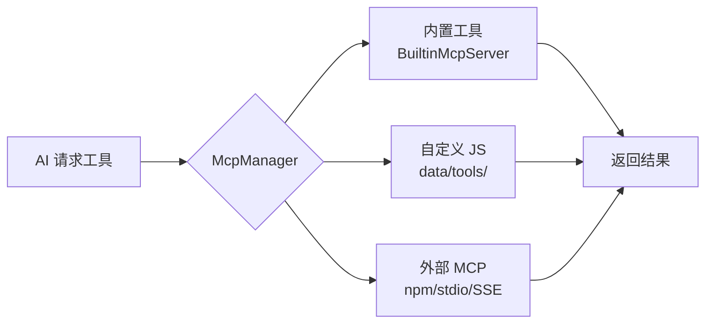
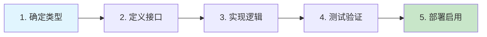

# 工具开发概述 <Badge type="tip" text="MCP" />

ChatAI Plugin 基于 **MCP (Model Context Protocol)** 标准实现工具系统，支持三种工具来源。

## 工具来源 {#tool-sources}

::: info 三种工具来源
根据需求选择合适的工具开发方式，从简单到复杂依次为：自定义 JS → 内置工具 → 外部 MCP
:::

| 来源 | 位置 | 说明 | 热重载 |
|:-----|:-----|:-----|:------:|
| **内置工具** | `src/mcp/tools/` | 核心功能，20个类别模块化组织 | ✅ |
| **自定义 JS** | `data/tools/` | 用户脚本，无需修改源码 | ✅ |
| **外部 MCP** | `data/mcp-servers.json` | npm 包或远程服务器 | ❌ |



## 工具定义格式 {#tool-format}

所有工具遵循 **MCP 标准**的统一定义格式：

```javascript{2,5,8-18,21-24}
{
  // 工具名称（唯一标识，snake_case 格式）
  name: 'my_tool',
  
  // 工具描述（AI 可见，描述清晰有助于 AI 正确调用）
  description: '工具功能描述，说明何时使用、参数含义',
  
  // 参数定义（JSON Schema 格式）
  inputSchema: {
    type: 'object',
    properties: {
      param1: {
        type: 'string',
        description: '参数描述'
      }
    },
    required: ['param1']
  },
  
  // 处理函数（异步）
  handler: async (args) => {
    // 实现逻辑
    return { result: '...' }
  }
}
```

## 上下文访问 {#context-access}

内置工具通过 `ToolContext` 访问运行时上下文，获取 Bot、事件、权限等信息。

::: tip ToolContext API
`ToolContext` 是工具执行时的核心上下文对象，定义于 `src/mcp/BuiltinMcpServer.js`
:::

```javascript{1,4,7-9,12,15-16}
import { getBuiltinToolContext } from '../../mcp/BuiltinMcpServer.js'

handler: async (args) => {
  const ctx = getBuiltinToolContext()
  
  // 获取 Bot 实例（自动处理多 Bot 环境）
  const bot = ctx.getBot()
  // 支持指定 Bot ID
  const specificBot = ctx.getBot(botId)
  
  // 获取消息事件
  const event = ctx.getEvent()
  const userId = event?.user_id
  const groupId = event?.group_id
  
  // 检查是否为主人
  const isMaster = ctx.isMaster
  
  // 获取适配器信息
  const adapter = ctx.getAdapter()
  // 返回: { adapter: 'icqq'|'napcat'|'onebot', isNT: boolean, canAiVoice: boolean }
  
  // 快捷判断方法
  ctx.isIcqq()    // 是否 ICQQ 适配器
  ctx.isNapCat()  // 是否 NapCat 适配器
  ctx.isNT()      // 是否支持 NT 特性
  
  // 获取 Bot 在群内的权限
  const permission = await ctx.getBotPermission(groupId)
  // 返回: { role: 'owner'|'admin'|'member', isAdmin: boolean, isOwner: boolean, inGroup: boolean }
}
```

## 返回值格式 {#return-format}

工具返回值会自动序列化并返回给 AI：

::: code-group
```javascript [简单文本]
return { text: '结果文本' }
```

```javascript [结构化数据]
return { 
  success: true,
  data: { key: 'value' }
}
```

```javascript [带额外信息]
return {
  text: '当前时间: 14:30',
  datetime: '2024-12-15T06:30:00.000Z',
  timestamp: 1702622400000
}
```

```javascript [错误处理]
// 方式1：抛出错误
throw new Error('操作失败：权限不足')

// 方式2：返回错误对象
return { error: true, message: '操作失败' }
```
:::

::: warning 返回值注意事项
- 返回值应简洁明了，避免返回大量无关数据
- `text` 字段会直接展示给 AI，应为人类可读格式
- 结构化数据适合需要进一步处理的场景
:::

## 开发流程 {#dev-workflow}



| 步骤 | 说明 | 要点 |
|:-----|:-----|:-----|
| **1. 确定类型** | 选择内置/自定义/MCP | 简单功能用自定义 JS，复杂功能用内置工具 |
| **2. 定义接口** | 名称、描述、参数 | 描述要清晰，参数用 JSON Schema |
| **3. 实现逻辑** | 编写 handler 函数 | 注意异常处理和权限检查 |
| **4. 测试验证** | API 测试或对话测试 | 使用 `#工具日志` 查看调用详情 |
| **5. 部署启用** | 配置权限后启用 | 通过 Web 面板管理工具启用状态 |

## 详细文档 {#detailed-docs}

::: tip 📚 选择适合的开发方式
:::

| 文档 | 适用场景 | 难度 |
|:-----|:---------|:----:|
| [内置工具](./builtin) | 需要深度集成、访问内部 API | ⭐⭐⭐ |
| [自定义 JS 工具](./custom-js) | 快速开发、无需修改源码 | ⭐ |
| [MCP 服务器](./mcp-server) | 接入外部服务、复用现有 MCP | ⭐⭐ |
| [安全与权限](./security) | 了解工具安全机制 | ⭐⭐ |
