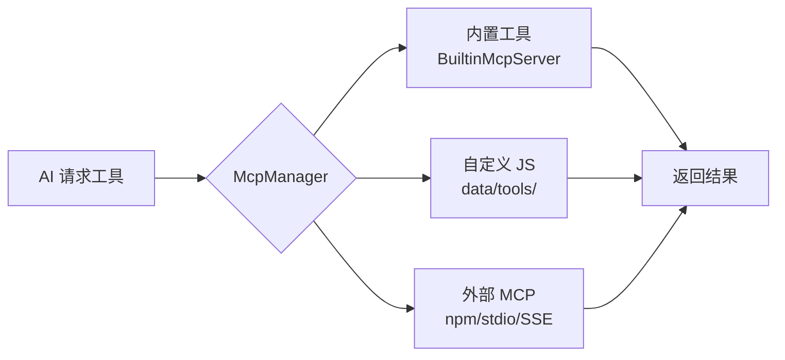

# 工具开发概述 <Badge type="tip" text="MCP" />

ChatAI Plugin 基于 **MCP (Model Context Protocol)** 标准实现工具系统，支持三种工具来源。

## 工具来源 {#tool-sources}

::: info 三种工具来源
根据需求选择合适的工具开发方式，从简单到复杂依次为：自定义 JS → 内置工具 → 外部 MCP
:::

| 来源 | 位置 | 说明 | 热重载 |
|:-----|:-----|:-----|:------:|
| **内置工具** | `src/mcp/tools/` | 核心功能，24个类别模块化组织 | ✅ |
| **自定义 JS** | `data/tools/` | 用户脚本，无需修改源码 | ✅ |
| **外部 MCP** | `data/mcp-servers.json` | npm 包或远程服务器 | ❌ |


```mermaid
graph LR
    A[AI 请求工具] --> B{McpManager}
    B --> C[内置工具<br/>BuiltinMcpServer]
    B --> D[自定义 JS<br/>data/tools/]
    B --> E[外部 MCP<br/>npm/stdio/SSE]
    C --> F[返回结果]
    D --> F
    E --> F
```

## Skills 文件系统 {#skills-files}

除了上述三种工具来源，系统还支持从 `data/skills` 目录加载技能文档：

| 文件格式 | 说明 | 自动激活 |
|---------|------|:-------:|
| `SKILL.md` | Markdown frontmatter + 指令正文 | 按 autoActivate 配置 |
| `*.skill.yaml` | YAML 格式技能定义 | 按 autoActivate 配置 |
| `*.skill.json` | JSON 格式技能定义 | 按 autoActivate 配置 |

### 技能加载机制

1. **默认暴露**: 系统启动时扫描所有技能文件，只暴露技能列表（名称+描述）
2. **显式加载**: 模型通过 `load_skill` 工具请求加载完整技能内容
3. **自动注入**: `autoActivate: true` 的技能在对话开始时自动注入
4. **上下文重载**: 上下文压缩后自动重新注入已加载的技能

### 扫描路径

默认扫描以下目录：
- `data/skills/` - 主要技能目录
- `.cursor/skills/` - IDE 技能目录
- `.claude/skills/` - Claude Code 技能目录
- `.codex/skills/` - Codex 技能目录

## Skills 配置文件 {#skills-yaml}

Skills 模块的完整配置集中在 `data/skills.yaml`（由 `src/services/skills/SkillsConfig.js` 加载与校验），与 MCP 服务器配置解耦。文件不存在时会以默认值自动创建，且支持热重载（`hasChanged()` 检测 mtime 变化后 `reload()`）。所有配置均位于顶层 `skills` 键下。

### 顶层结构 {#skills-yaml-overview}

```yaml
skills:
  enabled: true          # 是否启用 Skills 模块
  mode: 'hybrid'         # 工作模式：hybrid / skills-only / mcp-only
  sources: {...}         # 工具源配置
  groups: [...]          # 工具组配置
  execution: {...}       # 工具执行配置
  dispatch: {...}        # 调度配置（轻量模型预筛工具组）
  documents: {...}       # SKILL.md 文档技能配置
  security: {...}        # 危险工具安全配置
```

### 工作模式 mode {#skills-yaml-mode}

| 取值 | 说明 |
|:-----|:-----|
| `hybrid` | **默认**。同时加载 Skills 配置的工具（内置 + 自定义 JS）和 MCP 服务器工具 |
| `skills-only` | 仅加载 Skills 配置的工具，忽略 MCP 服务器（`isMcpEnabled()` 返回 `false`）|
| `mcp-only` | 仅加载 MCP 服务器工具，忽略内置与自定义 JS 工具（兼容旧行为）|

::: info 无效值回退
`mode` 仅接受上述三个取值，配置为其他值时会在校验阶段告警并回退为 `hybrid`。
:::

### 工具源 sources {#skills-yaml-sources}

三种工具来源可独立启用/禁用，并各自维护禁用工具列表：

```yaml
sources:
  builtin:                 # 内置工具
    enabled: true
    categories: []         # 启用的类别列表（空数组 = 启用全部）
    disabledTools: []      # 禁用的工具（优先级高于 categories）
  custom:                  # 自定义 JS 工具
    enabled: true
    path: 'data/tools'     # JS 工具目录（相对插件根目录）
    autoReload: true       # 文件变更自动重载
  mcp:                     # 外部 MCP 服务器工具
    enabled: true
    servers: []            # 启用的服务器列表
    disabledServers: []    # 禁用的服务器列表
```

::: tip disabledTools 合并
`getDisabledTools()` 会去重合并 `builtin`、`custom`、`mcp` 三个来源各自的 `disabledTools`，任一来源禁用即全局禁用。
:::

### 工具组 groups {#skills-yaml-groups}

`groups` 将工具按功能划分为逻辑组，供调度和权限管理使用。用户配置的 `groups` 会**完全替换**默认值（而非合并）。

```yaml
groups:
  - index: 0                    # 组索引（唯一）
    name: 'basic'               # 组名称（唯一）
    description: '基础工具：获取时间、日期、农历、节日、系统环境信息等'
    tools: ['get_current_time', 'get_lunar_date', ...]  # 工具名列表
    enabled: true               # 是否启用该组
  - index: 6
    name: 'admin'
    description: '群管理：禁言、踢人、设置群名片/头衔、发送公告等'
    tools: ['mute_member', 'kick_member', ...]
    enabled: true
    requiredPermission: 'admin' # 该组所需权限（可选）
  - index: 17
    name: 'shell'
    description: '系统命令（危险工具）'
    tools: ['execute_command', 'get_system_info', ...]
    enabled: false              # 危险组默认关闭
    requiredPermission: 'master'
```

| 字段 | 类型 | 说明 |
|:-----|:-----|:-----|
| `index` | `number` | 组索引，可通过 `getGroupByIndex()` 检索 |
| `name` | `string` | 组名称，可通过 `getGroupByName()` 检索；缺失时告警 |
| `description` | `string` | 组说明 |
| `tools` | `string[]` | 组内工具名列表；非数组时会被重置为 `[]` |
| `enabled` | `boolean` | 是否启用；`getEnabledGroups()` 过滤 `enabled !== false` |
| `requiredPermission` | `string` | 该组所需权限（如 `admin`、`master`），可选 |

### 文档技能 documents {#skills-yaml-documents}

控制 `SKILL.md` 等文档技能的扫描与注入行为（对应 [Skills 文件系统](#skills-files)）：

```yaml
documents:
  enabled: true
  mode: 'auto'                  # auto / all / explicit
  paths:                        # 扫描目录列表
    - 'data/skills'
    - '.cursor/skills'
    - '.claude/skills'
    - '.codex/skills'
  maxDepth: 6                   # 目录递归最大深度
  maxFileBytes: 65536           # 单个技能文件最大字节数（<1024 时重置为 1024）
  maxPromptChars: 20000         # 注入 system prompt 的最大字符数（<1000 时重置为 1000）
```

| `mode` | 匹配行为 |
|:-------|:---------|
| `auto` | **默认**。按上下文文本匹配技能的 name/description/relativePath/triggers |
| `all` | 未显式指定时注入全部技能 |
| `explicit` | 仅注入 `selectedNames` 显式选中的技能 |

::: warning 无效值回退
`mode` 非 `auto`/`all`/`explicit` 时回退默认；`paths` 非数组、`maxDepth < 0` 时均回退默认值。
:::

### 执行配置 execution {#skills-yaml-execution}

```yaml
execution:
  timeout: 30000        # 单工具超时（毫秒），<1000 时重置为 1000
  maxParallel: 5        # 最大并行数，<1 重置为 1，>20 重置为 20
  retryOnError: false   # 出错是否重试
  maxRetries: 2         # 重试次数
  cacheResults: true    # 是否缓存结果
  cacheTTL: 60000       # 缓存有效期（毫秒）
```

### 调度配置 dispatch {#skills-yaml-dispatch}

启用后先用轻量模型判断需要哪些工具组，减少 token 消耗：

```yaml
dispatch:
  enabled: false        # 默认关闭，可在管理面板启用
  useSummary: true      # 使用工具组摘要参与判断
  maxGroups: 3          # 最多选取的工具组数量
```

### 安全配置 security {#skills-yaml-security}

```yaml
security:
  dangerousTools:               # 危险工具列表
    - kick_member
    - mute_member
    - recall_message
    - write_file
    - delete_file
    - execute_command
  allowDangerous: false         # 是否允许执行危险工具
  dangerousRequiredPermission: 'master'  # 危险工具所需权限
```

::: tip 与工具审批的关系
`security.dangerousTools` 会影响 [工具审批](./security#tool-approval) 的风险分级：命中列表的工具会被判定为高风险。危险工具的执行还需满足 `allowDangerous` 与 `dangerousRequiredPermission` 约束。
:::

## 工具定义格式 {#tool-format}

所有工具遵循 **MCP 标准**的统一定义格式：

```javascript{2,5,8-18,21-24}
{
  // 工具名称（唯一标识，snake_case 格式）
  name: 'my_tool',
  
  // 工具描述（AI 可见，描述清晰有助于 AI 正确调用）
  description: '工具功能描述，说明何时使用、参数含义',
  
  // 参数定义（JSON Schema 格式）
  inputSchema: {
    type: 'object',
    properties: {
      param1: {
        type: 'string',
        description: '参数描述'
      }
    },
    required: ['param1']
  },
  
  // 处理函数（异步）
  handler: async (args) => {
    // 实现逻辑
    return { result: '...' }
  }
}
```

## 上下文访问 {#context-access}

工具通过执行函数的第二个参数 `context` 访问运行时上下文。平台差异、目标 ID 类型、发送结果校验和不支持能力的兜底全部由标准接口处理。

::: tip ToolContext API
`context` 是请求级对象；模型创建的工具不得导入运行时单例或直接读取协议端对象。
:::

```javascript{1,4,7-9,12,15-16}
handler: async (args, context) => {
  const api = context.getApi()
  const message = context.message
  const event = context.getEvent()
  const userId = event?.user_id
  const groupId = event?.group_id
  
  // 检查是否为主人
  const isMaster = context.isMaster()
  
  // 通过标准接口发送/查询；不在工具中判断 QQBot、ICQQ 或 OneBot
  const permission = await api.getBotPermission(groupId)
  // 返回: { role: 'owner'|'admin'|'member', isAdmin: boolean, isOwner: boolean, inGroup: boolean }
}
```

## 返回值格式 {#return-format}

工具返回值会自动序列化并返回给 AI：

::: code-group
```javascript [简单文本]
return { text: '结果文本' }
```

```javascript [结构化数据]
return { 
  success: true,
  data: { key: 'value' }
}
```

```javascript [带额外信息]
return {
  text: '当前时间: 14:30',
  datetime: '2024-12-15T06:30:00.000Z',
  timestamp: 1702622400000
}
```

```javascript [错误处理]
// 方式1：抛出错误
throw new Error('操作失败：权限不足')

// 方式2：返回错误对象
return { error: true, message: '操作失败' }
```
:::

::: warning 返回值注意事项
- 返回值应简洁明了，避免返回大量无关数据
- `text` 字段会直接展示给 AI，应为人类可读格式
- 结构化数据适合需要进一步处理的场景
:::

## 开发流程 {#dev-workflow}


```mermaid
flowchart LR
    A[1. 确定类型] --> B[2. 定义接口]
    B --> C[3. 实现逻辑]
    C --> D[4. 测试验证]
    D --> E[5. 部署启用]
    
    style A fill:#e1f5fe
    style E fill:#c8e6c9
```

| 步骤 | 说明 | 要点 |
|:-----|:-----|:-----|
| **1. 确定类型** | 选择内置/自定义/MCP | 简单功能用自定义 JS，复杂功能用内置工具 |
| **2. 定义接口** | 名称、描述、参数 | 描述要清晰，参数用 JSON Schema |
| **3. 实现逻辑** | 编写 handler 函数 | 注意异常处理和权限检查 |
| **4. 测试验证** | API 测试或对话测试 | 使用 `#工具日志` 查看调用详情 |
| **5. 部署启用** | 配置权限后启用 | 通过 Web 面板管理工具启用状态 |

## 详细文档 {#detailed-docs}

::: tip 📚 选择适合的开发方式
:::

| 文档 | 适用场景 | 难度 |
|:-----|:---------|:----:|
| [内置工具](./builtin) | 需要深度集成、访问内部 API | ⭐⭐⭐ |
| [自定义 JS](./custom-js) | 快速创建自定义工具 | ⭐⭐ |
| [高级开发](./advanced) | 进阶技巧与最佳实践 | ⭐⭐⭐ |
| [MCP 服务器](./mcp-server) | 接入外部 MCP 服务 | ⭐⭐ |
| [安全与权限](./security) | 了解工具安全机制 | ⭐⭐ |
