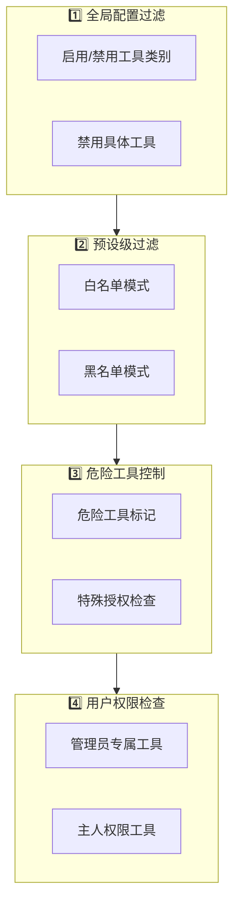
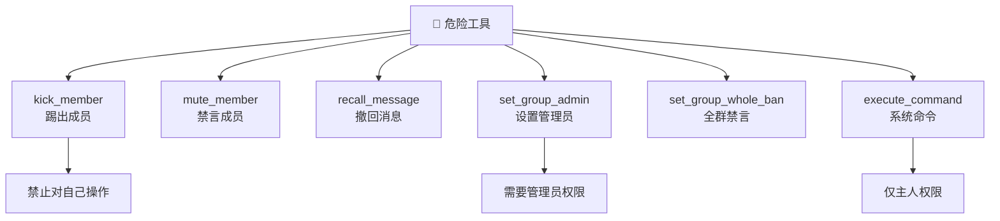
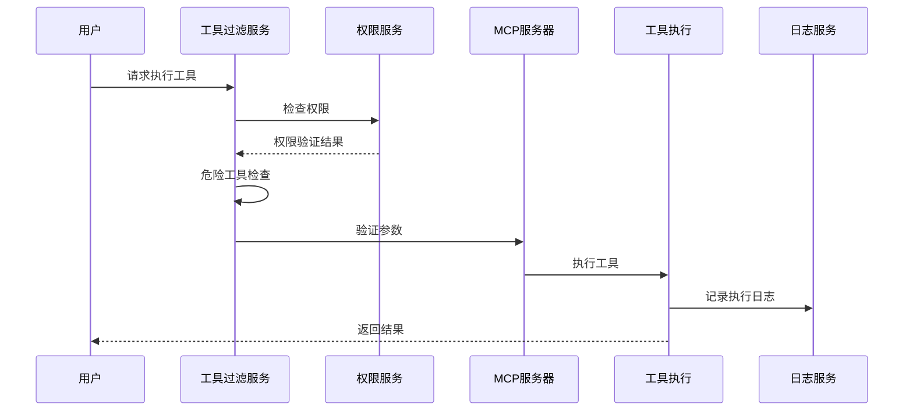

# 安全与权限 <Badge type="warning" text="重要" />

工具系统的安全控制机制，提供多层次的安全保障。

## 安全层级 {#security-layers}



::: tip 层级说明
工具调用请求需要依次通过所有安全层级的检查，任一层级拒绝则调用失败。
:::

## 全局配置

### 启用/禁用类别

```yaml
builtinTools:
  enabledCategories:
    - basic
    - user
    - web
  # 未列出的类别将被禁用
```

### 禁用特定工具

```yaml
builtinTools:
  disabledTools:
    - execute_command
    - delete_file
```

## 预设级过滤

### 白名单模式

```yaml
# 预设文件
tools:
  mode: whitelist
  allowedTools:
    - get_time
    - get_weather
    - search_web
```

### 黑名单模式

```yaml
tools:
  mode: blacklist
  excludedTools:
    - send_message
    - kick_member
```

## 危险工具 {#dangerous-tools}

### 危险工具分类



### 标记危险工具

```javascript
// 工具定义中
{
  name: 'execute_command',
  description: '执行系统命令',
  dangerous: true,  // 标记为危险
  
  async execute(args) {
    // ...
  }
}
```

### 危险工具配置

```yaml
builtinTools:
  # 是否允许危险工具
  allowDangerous: false
  
  # 危险工具列表
  dangerousTools:
    - kick_member
    - recall_message
    - set_group_whole_ban
    - execute_command
```

### 临时授权

某些场景需要临时允许危险工具：

```javascript
const agent = await createSkillsAgent({
  event: e,
  allowDangerous: true  // 临时授权
})
```

## 管理员工具

### 标记管理员专属

```javascript
{
  name: 'kick_member',
  description: '踢出群成员',
  adminOnly: true,  // 需要管理员权限
  
  async execute(args, context) {
    if (!context.isAdmin) {
      throw new Error('需要管理员权限')
    }
    // ...
  }
}
```

### 配置管理员工具

```yaml
mcp:
  security:
    adminOnlyTools:
      - kick_member
      - ban_member
      - set_group_admin
```

## 参数验证

工具执行前自动验证参数：

```javascript
{
  parameters: {
    type: 'object',
    properties: {
      userId: {
        type: 'string',
        pattern: '^[0-9]+$'  // 只允许数字
      },
      count: {
        type: 'integer',
        minimum: 1,
        maximum: 100
      }
    },
    required: ['userId']
  }
}
```

## 速率限制

### 工具级限制

```javascript
{
  name: 'expensive_tool',
  rateLimit: {
    maxCalls: 10,
    windowMs: 60000  // 每分钟最多 10 次
  }
}
```

### 用户级限制

```yaml
mcp:
  rateLimit:
    perUser:
      maxCalls: 100
      windowMs: 3600000  # 每小时 100 次
```

## 日志审计

### 记录工具调用

```yaml
mcp:
  logging:
    enabled: true
    level: info
    retention: 30  # 保留 30 天
```

### 日志内容

```json
{
  "id": "uuid",
  "toolName": "send_message",
  "args": {"target": "123", "content": "..."},
  "result": "success",
  "userId": "456",
  "timestamp": "2024-12-15T06:30:00.000Z",
  "duration": 150
}
```

### 查看日志

```bash
# 命令
#工具日志

# API
GET /api/tools/logs?limit=100&toolName=send_message
```

## 安全执行流程 {#execution-flow}



## 最佳实践 {#best-practices}

::: tip 安全建议
遵循以下最佳实践确保工具系统安全运行。
:::

| 实践 | 说明 |
|:-----|:-----|
| **最小权限原则** | 只启用必需的工具，禁用不需要的功能 |
| **使用白名单模式** | 预设中使用白名单，明确列出允许的工具 |
| **禁用危险工具** | 生产环境务必设置 `allowDangerous: false` |
| **定期审计日志** | 定期检查工具调用日志，发现异常行为 |
| **严格参数校验** | 定义参数 Schema，防止注入攻击 |

## 安全检查清单 {#checklist}

::: warning 部署前检查
确保完成以下安全检查项：
:::

- [ ] 已禁用不需要的工具类别
- [ ] 危险工具已禁用或受控
- [ ] 管理员工具已正确配置
- [ ] 预设使用白名单模式
- [ ] 日志审计已启用
- [ ] 速率限制已配置

## 下一步 {#next}

- [工具开发概述](./index) - 返回概述
- [MCP 配置](/config/mcp) - MCP 配置详情
