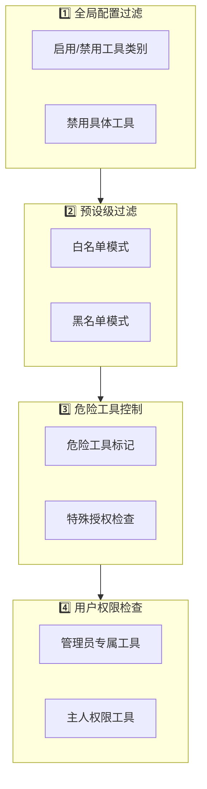
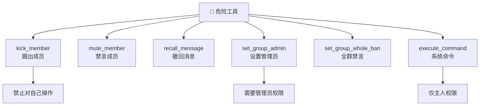
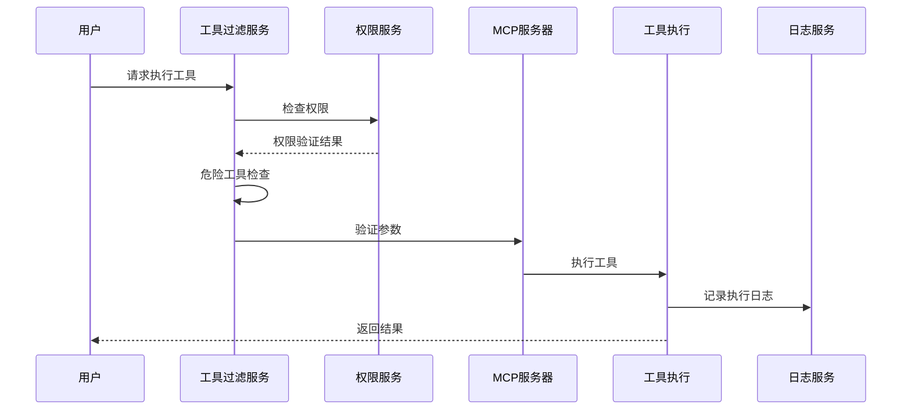

# 安全与权限 <Badge type="warning" text="重要" />

工具系统的安全控制机制，提供多层次的安全保障。

## 安全层级 {#security-layers}


```mermaid
flowchart TB
    subgraph L1["1️⃣ 全局配置过滤"]
        A1[启用/禁用工具类别]
        A2[禁用具体工具]
    end
    
    subgraph L2["2️⃣ 预设级过滤"]
        B1[白名单模式]
        B2[黑名单模式]
    end
    
    subgraph L3["3️⃣ 危险工具控制"]
        C1[危险工具标记]
        C2[特殊授权检查]
    end
    
    subgraph L4["4️⃣ 用户权限检查"]
        D1[管理员专属工具]
        D2[主人权限工具]
    end
    
    L1 --> L2 --> L3 --> L4
```

::: tip 层级说明
工具调用请求需要依次通过所有安全层级的检查，任一层级拒绝则调用失败。
:::

## 全局配置

### 启用/禁用类别

```yaml
builtinTools:
  enabledCategories:
    - basic
    - user
    - web
  # 未列出的类别将被禁用
```

### 禁用特定工具

```yaml
builtinTools:
  disabledTools:
    - execute_command
    - delete_file
```

## 预设级过滤

### 白名单模式

```yaml
# 预设文件
tools:
  mode: whitelist
  allowedTools:
    - get_current_time
    - get_weather
    - web_search
```

### 黑名单模式

```yaml
tools:
  mode: blacklist
  excludedTools:
    - send_group_message
    - kick_member
```

## 危险工具 {#dangerous-tools}

### 危险工具分类


```mermaid
flowchart TD
    Dangerous[🔴 危险工具] --> Kick[kick_member<br/>踢出成员]
    Dangerous --> Mute[mute_member<br/>禁言成员]
    Dangerous --> Recall[recall_message<br/>撤回消息]
    Dangerous --> Admin[set_group_admin<br/>设置管理员]
    Dangerous --> Ban[set_group_whole_ban<br/>全群禁言]
    Dangerous --> Shell[execute_command<br/>系统命令]
    
    Shell --> Master[仅主人权限]
    Admin --> Role[需要管理员权限]
    Kick --> Self[禁止对自己操作]
```

### 标记危险工具

```javascript
// 工具定义中
{
  name: 'execute_command',
  description: '执行系统命令',
  dangerous: true,  // 标记为危险
  
  async execute(args) {
    // ...
  }
}
```

### 危险工具配置

```yaml
builtinTools:
  # 是否允许危险工具
  allowDangerous: false
  
  # 危险工具列表
  dangerousTools:
    - kick_member
    - recall_message
    - set_group_whole_ban
    - execute_command
```

### 临时授权

某些场景需要临时允许危险工具：

```javascript
const agent = await createSkillsAgent({
  event: e,
  allowDangerous: true  // 临时授权
})
```

## 工具审批 {#tool-approval}

除静态的类别/预设过滤外，系统还提供**运行时工具审批**机制（`src/services/tools/ToolApprovalService.js`）。当模型请求执行工具时，`preflight` 会逐个进行归属校验、权限校验、参数校验和风险分级，再根据审批模式决定放行、拦截或向用户发起确认。

### 审批模式 {#approval-mode}

审批模式由 `builtinTools.approvalMode` 控制，可选值 `ask`、`auto`、`confirm_all`、`yolo`，无效值回退为 `auto`。

| 模式 | 行为 |
|:-----|:-----|
| `ask` | 拦截所有工具，一律不执行（返回"ask 模式不执行工具"），仅让模型知道有哪些工具可用 |
| `auto` | **默认**。低风险工具自动放行；中风险、高风险工具需用户确认 |
| `confirm_all` | 所有工具（含低风险）都需用户确认后才执行 |
| `yolo` | 全部自动放行，跳过所有确认 |

::: tip 单次调用覆盖
`preflight` 支持通过 `options.toolApprovalMode` 在单次请求内覆盖全局 `approvalMode`。
:::

### 风险分级 {#risk-classification}

每个工具在审批前会被划分为 `low` / `medium` / `high` 三级，判定顺序如下（前者优先）：

1. **配置精确匹配**：命中 `approvalHighRiskTools` / `approvalMediumRiskTools` / `approvalLowRiskTools`（按工具名或 identity 匹配）直接采用对应等级
2. **高风险判定**：工具自身 `dangerous` 标记、命中 `builtinTools.dangerousTools`、或属于内置高风险集合（如 `kick_member`、`mute_member`、`recall_message`、`set_group_admin`、`write_file`、`delete_file`、`execute_command` 等）
3. **中风险判定**：属于内置中风险集合，或工具名匹配 `send_*`、`*_message`、`file`、`url`、`webpage`、`download`、`memory`、`context`、`image`、`voice`、`media` 等启发式规则
4. **低风险判定**：属于内置低风险集合，或工具名匹配 `get_*`、`list_*`、`search_*`、`query_*`、`calculate` 等只读/计算类前缀
5. **兜底**：未命中任何规则时默认为 `medium`

::: info 内置默认分级（部分）
- **低风险**：`get_time`、`get_date`、`get_system_info`、`calculate`、`web_search`、`get_weather` 等
- **中风险**：`send_message`、`send_group_message`、`read_file`、`fetch_url`、`generate_image`、`save_memory` 等
- **高风险**：`kick_member`、`mute_member`、`recall_message`、`set_group_admin`、`write_file`、`delete_file`、`execute_command` 等
:::

### 审批交互与超时 {#approval-interaction}

需要确认的工具会汇总为一条提示消息（通过 `event.reply` 发送），列出工具名、风险等级和脱敏后的参数摘要。用户可回复以下指令进行响应：

| 回复 | 动作 |
|:-----|:-----|
| `确认` / `确认工具` | 放行本次待确认的工具调用 |
| `取消` / `拒绝` | 取消执行（返回"用户取消"）|
| `允许本对话` | 放行并对本会话内同一工具建立豁免 |
| `确认工具 <8位ID>` / `取消工具 <8位ID>` | 针对指定审批 ID 精确响应 |

::: warning 超时处理
审批等待时间由 `builtinTools.approvalTimeoutMs` 控制（默认 `60000` 毫秒）。超时未响应视为拒绝，工具不执行（返回"确认超时"）。若当前环境无 `event.reply`（无法发起确认），需要确认的工具会被直接拦截。
:::

::: tip 参数脱敏
审批提示中的参数会自动脱敏：键名匹配 `api_key`、`token`、`password`、`secret`、`authorization`、`cookie`、`key` 的值替换为 `***`；超长字符串截断至 160 字符，整体摘要截断至 500 字符。
:::

### 会话豁免 {#session-bypass}

当用户选择"允许本对话"时，系统会为该工具在当前会话建立豁免，后续同一工具调用无需再次确认。

- 豁免作用域键为 `conversationId:groupId:userId`，即同一会话、同一群、同一用户
- 是否允许豁免由 `approvalAllowSessionBypass` 控制（默认 `true`）
- 可豁免的最高风险由 `approvalSessionBypassMaxRisk` 控制（默认 `medium`）：仅风险等级不超过该值的工具可被会话豁免，高风险工具即使选择"允许本对话"也不会建立豁免

### 审批配置 {#approval-config}

```yaml
builtinTools:
  # 审批模式：ask / auto / confirm_all / yolo
  approvalMode: auto
  # 审批等待超时（毫秒），超时视为拒绝
  approvalTimeoutMs: 60000
  # 强制指定各风险等级的工具（按工具名或 identity 匹配，优先级最高）
  approvalLowRiskTools: []
  approvalMediumRiskTools: []
  approvalHighRiskTools: []
  # 始终跳过审批的工具（yolo 之外的白名单）
  approvalBypassTools: []
  # 是否允许"允许本对话"会话豁免
  approvalAllowSessionBypass: true
  # 可会话豁免的最高风险等级：low / medium / high
  approvalSessionBypassMaxRisk: medium
```

::: info approvalBypassTools 与 yolo 的区别
`approvalBypassTools` 是针对具体工具的白名单，在任何模式下（`ask` 除外）命中即放行，无论其风险等级；`yolo` 则是对所有工具全局放行。
:::

## 管理员工具

### 标记管理员专属

```javascript
{
  name: 'kick_member',
  description: '踢出群成员',
  adminOnly: true,  // 需要管理员权限
  
  async execute(args, context) {
    if (!context.isAdmin) {
      throw new Error('需要管理员权限')
    }
    // ...
  }
}
```

### 配置管理员工具

```yaml
mcp:
  security:
    adminOnlyTools:
      - kick_member
      - ban_member
      - set_group_admin
```

## 参数验证

工具执行前自动验证参数：

```javascript
{
  parameters: {
    type: 'object',
    properties: {
      userId: {
        type: 'string',
        pattern: '^[0-9]+$'  // 只允许数字
      },
      count: {
        type: 'integer',
        minimum: 1,
        maximum: 100
      }
    },
    required: ['userId']
  }
}
```

## 速率限制

### 工具级限制

```javascript
{
  name: 'expensive_tool',
  rateLimit: {
    maxCalls: 10,
    windowMs: 60000  // 每分钟最多 10 次
  }
}
```

### 用户级限制

```yaml
mcp:
  rateLimit:
    perUser:
      maxCalls: 100
      windowMs: 3600000  # 每小时 100 次
```

## 日志审计

### 记录工具调用

```yaml
mcp:
  logging:
    enabled: true
    level: info
    retention: 30  # 保留 30 天
```

### 日志内容

```json
{
  "id": "uuid",
  "toolName": "send_group_message",
  "args": {"target": "123", "content": "..."},
  "result": "success",
  "userId": "456",
  "timestamp": "2024-12-15T06:30:00.000Z",
  "duration": 150
}
```

### 查看日志

```bash
# 命令
#工具日志

# API
GET /api/tools/logs?limit=100&toolName=send_group_message
```

## 安全执行流程 {#execution-flow}


```mermaid
sequenceDiagram
    participant User as 用户
    participant Filter as 工具过滤服务
    participant Perm as 权限服务
    participant MCP as MCP服务器
    participant Tools as 工具执行
    participant Log as 日志服务
    
    User->>Filter: 请求执行工具
    Filter->>Perm: 检查权限
    Perm-->>Filter: 权限验证结果
    Filter->>Filter: 危险工具检查
    Filter->>MCP: 验证参数
    MCP->>Tools: 执行工具
    Tools->>Log: 记录执行日志
    Tools-->>User: 返回结果
```

## 最佳实践 {#best-practices}

::: tip 安全建议
遵循以下最佳实践确保工具系统安全运行。
:::

| 实践 | 说明 |
|:-----|:-----|
| **最小权限原则** | 只启用必需的工具，禁用不需要的功能 |
| **使用白名单模式** | 预设中使用白名单，明确列出允许的工具 |
| **禁用危险工具** | 生产环境务必设置 `allowDangerous: false` |
| **定期审计日志** | 定期检查工具调用日志，发现异常行为 |
| **严格参数校验** | 定义参数 Schema，防止注入攻击 |

## 安全检查清单 {#checklist}

::: warning 部署前检查
确保完成以下安全检查项：
:::

- [ ] 已禁用不需要的工具类别
- [ ] 危险工具已禁用或受控
- [ ] 管理员工具已正确配置
- [ ] 预设使用白名单模式
- [ ] 日志审计已启用
- [ ] 速率限制已配置

## 下一步 {#next}

- [工具开发概述](./index) - 返回概述
- [MCP 配置](/config/mcp) - MCP 配置详情
