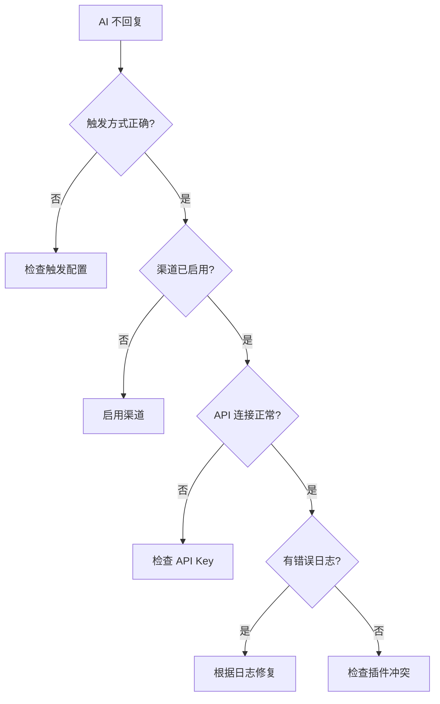
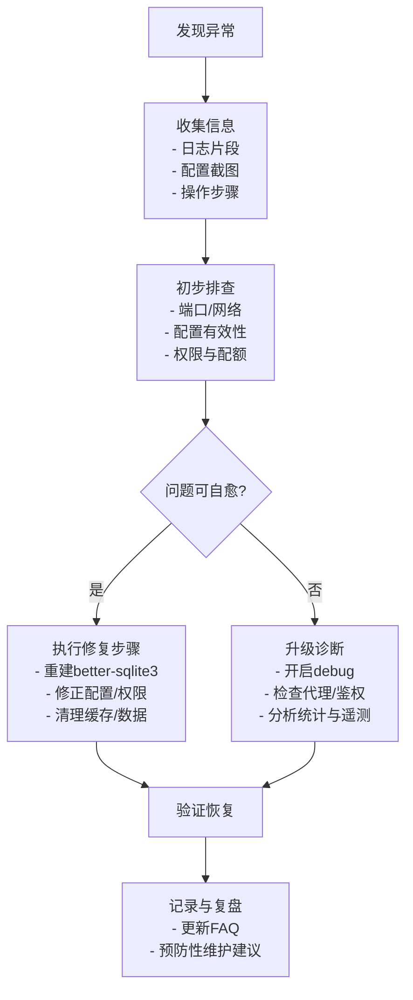

# 故障排除 <Badge type="warning" text="FAQ" />

本文档帮助你解决使用 ChatAI Plugin 时遇到的常见问题。

::: tip 快速定位问题
使用 `Ctrl+F` 搜索错误关键词，或按目录分类查找。
:::

## 安装问题 {#installation}

### better-sqlite3 构建失败 {#sqlite3-build-fail}

::: danger 错误信息
`Could not locate the bindings file` 或 `node-gyp rebuild failed`
:::

**解决步骤：**

**Step 1** - 在 Yunzai 根目录重建
```bash
pnpm rebuild better-sqlite3
```

**Step 2** - 如果仍失败，安装编译工具

::: code-group
```bash [Windows]
# 安装 Visual Studio Build Tools
# 下载: https://visualstudio.microsoft.com/visual-cpp-build-tools/
# 安装时选择 "使用 C++ 的桌面开发"
npm install -g windows-build-tools
```

```bash [Linux (Debian/Ubuntu)]
sudo apt update
sudo apt install build-essential python3
```

```bash [Linux (CentOS/RHEL)]
sudo yum groupinstall "Development Tools"
sudo yum install python3
```

```bash [macOS]
xcode-select --install
```
:::

**Step 3** - 完全重装
```bash
rm -rf node_modules
pnpm install
pnpm rebuild better-sqlite3
```

::: details 其他可能的解决方案
```bash
# 设置 Python 路径
npm config set python /usr/bin/python3

# 全局安装 node-gyp
npm install -g node-gyp

# 清理缓存后重试
pnpm store prune
```
:::

### Node.js 版本不兼容 {#node-version}

::: danger 错误信息
启动报错 `SyntaxError` 或功能异常
:::

**解决方案：**

```bash
# 检查版本（需要 18.0+）
node -v

# 使用 nvm 切换版本
nvm install 18
nvm use 18

# 或使用 fnm
fnm install 18
fnm use 18
```

### 依赖安装失败 {#deps-install-fail}

::: danger 错误信息
`pnpm install` 报错，如 `ENOENT`、`EPERM` 等
:::

**解决方案：**

```bash
# 清理缓存
pnpm store prune

# 删除 lockfile 重装
rm pnpm-lock.yaml
pnpm install
```

::: warning Windows 用户注意
如果遇到权限问题，尝试以管理员身份运行命令行
:::

## 启动问题 {#startup}

### 插件无法加载 {#plugin-load-fail}

::: danger 错误信息
控制台无 `[ChatAI]` 相关日志，或报 `Cannot find module` 错误
:::

**检查清单：**

| 检查项 | 说明 | 修复方法 |
|:-------|:-----|:---------|
| 入口文件 | `index.js` 必须存在 | 重新克隆插件 |
| 依赖安装 | 依赖必须完整 | 运行 `pnpm install` |
| 控制台日志 | 查看详细错误信息 | 根据错误修复 |

### Web 面板无法访问 {#web-panel-fail}

::: danger 错误信息
浏览器无法打开管理面板链接，显示连接超时或拒绝
:::

**排查步骤：**

**1. 检查端口占用**

::: code-group
```bash [Linux/macOS]
netstat -tlnp | grep 3000
lsof -i :3000
```

```powershell [Windows]
netstat -ano | findstr :3000
```
:::

**2. 检查防火墙**

::: code-group
```bash [Linux (ufw)]
sudo ufw allow 3000
```

```bash [Linux (firewalld)]
sudo firewall-cmd --add-port=3000/tcp --permanent
sudo firewall-cmd --reload
```

```powershell [Windows]
# 在 Windows 防火墙中添加入站规则
```
:::

**3. 修改监听地址**

```yaml
# config.yaml
web:
  host: "0.0.0.0"  # 允许外部访问（默认 127.0.0.1 仅本地）
  port: 3000       # 端口被占用时修改为其他端口
```

### 数据库初始化失败 {#db-init-fail}

::: danger 错误信息
`SQLITE_CANTOPEN` 或 `database is locked`
:::

**解决步骤：**

```bash
# 1. 重建 better-sqlite3
pnpm rebuild better-sqlite3

# 2. 检查目录权限（Linux/macOS）
chmod 755 plugins/chatgpt-plugin/data

# 3. 删除数据库文件重建（会丢失数据！）
rm plugins/chatgpt-plugin/data/*.db
```

::: warning 数据备份
删除数据库前请先备份 `data/` 目录，避免数据丢失
:::

## 使用问题 {#usage}

### AI 不回复 {#no-reply}

::: danger 现象
发送消息后机器人无任何反应
:::

**排查流程图：**



**检查清单：**

| 检查项 | 操作 | 说明 |
|:-------|:-----|:-----|
| **触发方式** | 确认使用正确的触发方式 | @触发、前缀触发（如 `#chat`） |
| **渠道配置** | Web 面板检查渠道状态 | 点击「测试连接」验证 |
| **调试模式** | 发送 `#ai调试开启` | 查看详细错误信息 |
| **插件冲突** | 检查其他插件是否拦截 | 调整插件优先级 |

### API 认证失败 (401/403) {#api-auth-fail}

::: danger 错误码
`401 Unauthorized` 或 `403 Forbidden`
:::

| 可能原因 | 解决方案 |
|:---------|:---------|
| API Key 错误 | 检查 Key 是否复制完整，无多余空格 |
| Key 已过期 | 登录供应商后台查看 Key 状态 |
| 余额不足 | 充值账户余额 |
| 权限不足 | 检查 Key 的 API 访问权限范围 |
| IP 限制 | 某些供应商限制 IP，检查是否需要配置代理 |

### API 限流 (429) {#api-rate-limit}

::: danger 错误码
`429 Too Many Requests` 或 `Rate limit exceeded`
:::

**解决方案：**

| 方案 | 说明 | 推荐度 |
|:-----|:-----|:------:|
| 多渠道负载均衡 | 配置多个渠道分散请求 | ⭐⭐⭐ |
| 增加请求间隔 | 在配置中设置 `requestInterval` | ⭐⭐ |
| 升级 API 套餐 | 提高 API 配额限制 | ⭐⭐⭐ |
| 使用备用渠道 | 配置故障转移渠道 | ⭐⭐⭐ |

### 消息重复 {#duplicate-msg}

::: warning 现象
同一条消息收到多次回复
:::

| 检查项 | 说明 |
|:-------|:-----|
| 重复适配器 | 确认没有同时启用多个 Bot 适配器 |
| 消息回显 | 检查 `config.yaml` 中的回显配置 |
| 插件去重 | 插件内置去重机制，正常情况下会自动处理 |

### 工具调用失败 {#tool-call-fail}

::: danger 现象
AI 尝试调用工具但返回错误或无响应
:::

**排查步骤：**

1. **确认工具已启用**
   - Web 面板 → 工具管理 → 检查工具状态

2. **检查权限配置**
   - 某些工具需要主人权限或群管权限

3. **查看工具日志**
   ```txt
   #工具日志
   ```

4. **开启调试模式**
   ```txt
   #ai调试开启
   ```

::: details 常见工具错误
| 错误 | 原因 | 解决 |
|:-----|:-----|:-----|
| `Tool not found` | 工具未启用或不存在 | 在 Web 面板启用工具 |
| `Permission denied` | 权限不足 | 检查用户权限配置 |
| `Timeout` | 工具执行超时 | 检查网络或工具逻辑 |
:::

## 性能问题 {#performance}

### 响应缓慢 {#slow-response}

::: warning 现象
AI 回复延迟高，等待时间长
:::

| 优化方案 | 说明 | 效果 |
|:---------|:-----|:----:|
| 减少上下文 | 降低 `context.maxMessages` 值 | ⭐⭐⭐ |
| 使用轻量模型 | 如 `gpt-4o-mini`、`deepseek-chat` | ⭐⭐⭐ |
| 启用流式响应 | 配置 `stream: true` | ⭐⭐ |
| 优化网络 | 配置代理或使用国内渠道 | ⭐⭐⭐ |

### 内存占用高 {#high-memory}

::: warning 现象
Node.js 进程内存持续增长
:::

| 优化方案 | 配置 |
|:---------|:-----|
| 减少上下文消息数 | `context.maxMessages: 10` |
| 定期清理历史 | 使用 `#结束对话` 命令 |
| 限制记忆条数 | `memory.maxMemories: 500` |
| 关闭不需要的功能 | 禁用未使用的工具类别 |

## 代理问题 {#proxy}

### 代理连接失败 {#proxy-fail}

::: danger 现象
API 请求超时或连接被拒绝
:::

**检查清单：**

| 检查项 | 命令/操作 |
|:-------|:----------|
| 代理服务运行 | 检查代理软件是否启动 |
| 端口正确 | 确认端口号（常见：7890、1080） |
| 代理类型 | http/socks5 需要匹配 |

**测试代理连通性：**

```bash
# 测试 HTTP 代理
curl -x http://127.0.0.1:7890 https://api.openai.com/v1/models

# 测试 SOCKS5 代理
curl -x socks5://127.0.0.1:1080 https://api.openai.com/v1/models
```

### 部分请求不走代理 {#proxy-bypass}

```yaml
# config.yaml
proxy:
  enabled: true
  type: http        # http 或 socks5
  host: 127.0.0.1
  port: 7890
  noProxy: []       # 确保没有误排除目标域名
```

## MCP 问题 {#mcp}

### MCP 服务器连接失败 {#mcp-connect-fail}

::: danger 现象
MCP 工具不可用，状态显示离线
:::

**排查步骤：**

1. **查看 MCP 状态**
   ```txt
   #mcp状态
   ```

2. **检查 npm 包安装**
   ```bash
   # 确认 MCP 服务器包已安装
   npm list -g @anthropic/mcp-server-xxx
   ```

3. **检查配置文件**
   ```json
   // data/mcp-servers.json
   {
     "servers": {
       "my-server": {
         "command": "npx",
         "args": ["-y", "@xxx/mcp-server"]
       }
     }
   }
   ```

### 工具不可用 {#tool-unavailable}

| 检查项 | 说明 |
|:-------|:-----|
| 服务器连接 | 确认 MCP 服务器状态为在线 |
| 工具列表 | 检查工具是否在 `tools/list` 返回中 |
| 权限配置 | 检查预设的工具白名单/黑名单 |

## 日志收集 {#logging}

### 开启调试模式 {#debug-mode}

```txt
#ai调试开启
```

::: tip 调试模式功能
- 显示详细的 API 请求/响应日志
- 显示工具调用详情
- 显示错误堆栈信息
:::

### 查看日志 {#view-logs}

::: code-group
```bash [Yunzai 日志]
# 实时查看日志
tail -f logs/latest.log

# 搜索错误日志
grep -i "error\|fail" logs/latest.log
```

```txt [工具日志]
#工具日志
```

```txt [MCP 状态]
#mcp状态
```
:::

### 提交问题 {#submit-issue}

::: info 提交 Issue 时请附带
1. **错误信息截图** - 完整的错误堆栈
2. **相关配置** - 隐藏 API Key 后的配置
3. **复现步骤** - 详细的操作步骤
4. **运行环境** - Node.js 版本、操作系统、Yunzai 版本
:::

## 常见错误码 {#error-codes}

| 错误码 | 说明 | 解决方案 |
|:------:|:-----|:---------|
| `401` | 认证失败 | 检查 API Key 是否正确 |
| `403` | 权限不足 | 检查 Key 权限范围 |
| `429` | 请求过多 | 降低频率或切换渠道 |
| `500` | 服务器错误 | 稍后重试 |
| `502` | 网关错误 | 检查代理或稍后重试 |
| `503` | 服务不可用 | 等待服务恢复 |
| `ECONNREFUSED` | 连接被拒绝 | 检查网络和代理配置 |
| `ETIMEDOUT` | 连接超时 | 检查网络或增加超时时间 |

## 标准化排查流程 {#troubleshoot-flow}



## 预防性维护 {#preventive-maintenance}

### 定期维护建议 {#maintenance-tips}

| 维护项 | 频率 | 说明 |
|:-------|:-----|:-----|
| **备份数据** | 每周 | 备份 `data/` 目录（config.yaml、数据库、预设） |
| **检查日志** | 每日 | 关注错误和警告信息 |
| **清理缓存** | 每月 | 清理过期会话和缓存数据 |
| **更新插件** | 按需 | 关注版本更新，及时升级 |

### 监控指标 {#monitoring}

::: tip 建议监控以下指标
- **实时 RPM**：1/5 分钟请求数
- **API 成功率**：调用成功比例
- **Token 用量**：令牌消耗趋势
- **工具调用错误率**：工具执行异常比例
- **数据库大小**：存储增长趋势
:::

### 更新后维护 {#post-update}

```bash
# 更新插件后执行
cd plugins/chatgpt-plugin
git pull
pnpm install
pnpm rebuild better-sqlite3  # 如涉及原生模块
```

## 获取帮助 {#get-help}

::: tip 🆘 获取支持
:::

| 渠道 | 链接 | 适用场景 |
|:-----|:-----|:---------|
| **GitHub Issues** | [提交 Issue](https://github.com/XxxXTeam/chatai-plugin/issues) | Bug 反馈、功能建议 |
| **项目文档** | [查看文档](/) | 配置和使用问题 |
